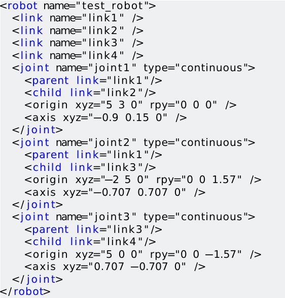

 
# ROBOT DESCRIPTION
Understanding how the world is formally described

---
 

## Agenda

1. **URDF - Universal Robot Description File**
2. **XACRO - XML Macros**
3. **Demo Setup**

---
 
## Motivation
Provide a human readable and platform independent way to define robots, sensors, scene objects etc.. including:  
  * Collission properties -> Either .stl or geometric primitives
  * Visual properties     -> Either .stl or geometric primitives
  * Joints and Links
  * Physical proeprties
    * Inertia 
  * Joint dynamics
    * Friction
    * Damping

---
 
## Setting up a 3DOD exemplery robot with URDF
http://wiki.ros.org/urdf/Tutorials/Create%20your%20own%20urdf%20file

 &nbsp;&nbsp;&nbsp;&nbsp; 

---
 
# Joint Types

URDF supports the following types of joints:   
- **Revolute** - rotates along an axis, has limited range 
- **Continuous** - rotates around an axis, has no limits
- **Prismatic** - slides along an axis, has limited range 
- **Fixed** - simplest, constant, not really a "joint"
- **Floating** - allows motion for all 6 DoF.
- **Planar** - allows motion in a plane perpendicular to an axis

---
 
## Completed URDF with kinematics
&nbsp;&nbsp;&nbsp;&nbsp;&nbsp;&nbsp;&nbsp;&nbsp;&nbsp;&nbsp;&nbsp;&nbsp;

---
 
## URDF vs XACRO

|URDF|XACRO|
|---|---|
|No constants| Properties & Parameters|
|Manual calculations| Basics maths allowed|
|Copy snippets to reproduce| Shortcut macros|
|Long, difficult to maintian|Shorter, modular, easier|

 

---
 
## URDF vs XACRO

 

---
 
## XACRO - Other features

Conditional &nbsp;&nbsp;&nbsp;&nbsp;&nbsp;&nbsp;&nbsp;&nbsp;&nbsp;&nbsp;&nbsp;&nbsp;&nbsp;&nbsp;&nbsp;&nbsp;&nbsp;&nbsp;&nbsp;&nbsp;&nbsp;Maths

Macro &nbsp;&nbsp;&nbsp;&nbsp;&nbsp;&nbsp;&nbsp;&nbsp;&nbsp;&nbsp;&nbsp;&nbsp;&nbsp;&nbsp;&nbsp;&nbsp;&nbsp;&nbsp;&nbsp;&nbsp;&nbsp;&nbsp;&nbsp;&nbsp;&nbsp;&nbsp;&nbsp;&nbsp;&nbsp;&nbsp;&nbsp;&nbsp;&nbsp;&nbsp;&nbsp;&nbsp;&nbsp;&nbsp;&nbsp;&nbsp;Params
  

>XACRO is always converted to URDF before being used

---
 
## Demo Setup
<!-- SHOW THIS ACTUAL SETUP FROM ISNTRUCTOR'S PC -->

The setup for today's demonstration has 3 static components described in URDF *(XACRO)*:
* Kinect - Image Sensor
* Table - World Object
* UR5 - Robot

It also includes an AR Tag that is dynamically placed in simulation.
  > This is why the tag is not described in URDF

---

 
## Table description

`tutorial_commons/urdf/table_ur.urdf.xacro` -> Brief look - Macro & Link only

---

 
## Kinect description

`tutorial_commons/urdf/kinect.xacro` -> Brief look - Macro, Link & Mesh only
.....

---

 
## UR5 description
`ur_description/urdf/ur5.urdf.xacro` -> Brief look - Macro & Links only

`ur_description/urdf/common.gazebo.xacro` - Gazebo controls, just FYI

---
 

## Combined description
`moveit_tutorial/urdf/ur_demo_description.urdf.xacro` -> Detailed look

---
 

## Combined description (contd..)
`moveit_tutorial/urdf/ur_demo_description.urdf.xacro` -> Detailed look

---
 

## Result - RVIZ
`roslaunch moveit_tutorial display.launch` 

---
 
## Result - GAZEBO

