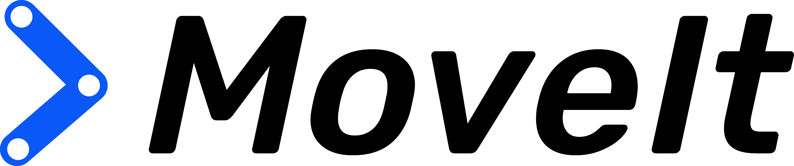
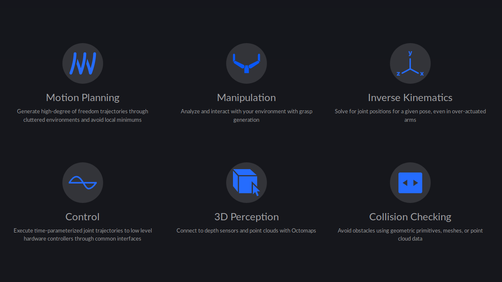
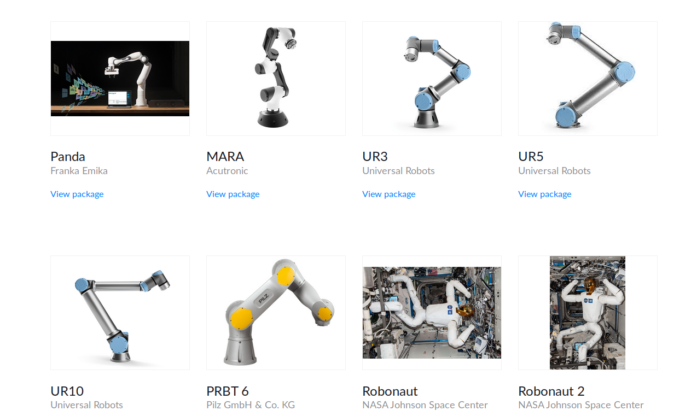
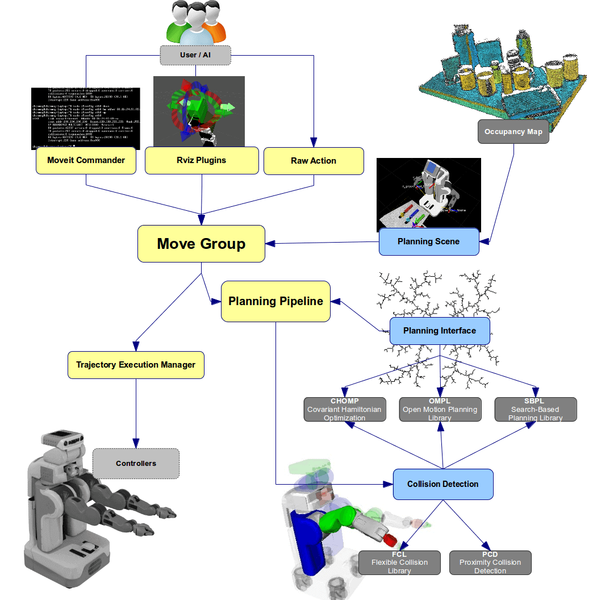
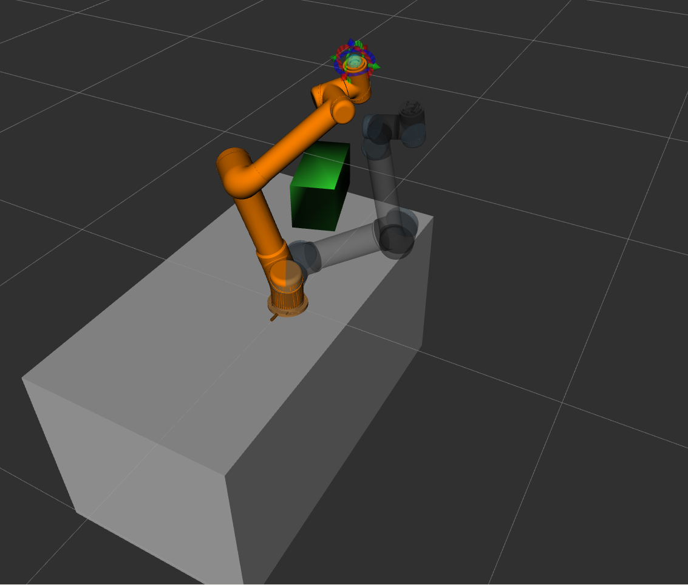

 
# MOVEIT - DRIVING THE JAG

---
 

Easy-to-use robotics manipulation platform for developing applications, evaluating designs, and building integrated products

---
 
## What can you do with MoveIt!?

---
 

# Why MoveIt!?
&nbsp;&nbsp;&nbsp;&nbsp;&nbsp;&nbsp;&nbsp;&nbsp;&nbsp;&nbsp;
Over 100 robots supported by MoveIt!(https://moveit.ros.org/robots/)

---
 
# Easy-to-use robotics platform

&nbsp;&nbsp;&nbsp;&nbsp;&nbsp;&nbsp;&nbsp;&nbsp;&nbsp;&nbsp;&nbsp;&nbsp;&nbsp;&nbsp;&nbsp;&nbsp;&nbsp;&nbsp;&nbsp;&nbsp;

---
 
# Common misconceptions about MoveIt! (from FAQs)

- What is the difference between MoveIt and ROS?
- What is the difference between MoveIt and ROS-Industrial?
- What is the difference between MoveIt and OMPL?

---
 
# Plugin based

  
https://moveit.ros.org/documentation/plugins/

---
 
# move_group node

---
 
# Live demo - Motion planning with RVIZ

<!-- Using the workspace with 
git@github.com:ipa-hsd/rosin-training.git in it-->
1. `roslaunch ur5_moveit_config_pkg demo.launch`
2. Plan simple path and execute
5. Import `tutorial_commons/meshes/table.stl`. Scale & position it
6. Publish scene, plan and execute around object.
---
 
# Live demo - Motion planning with RVIZ

