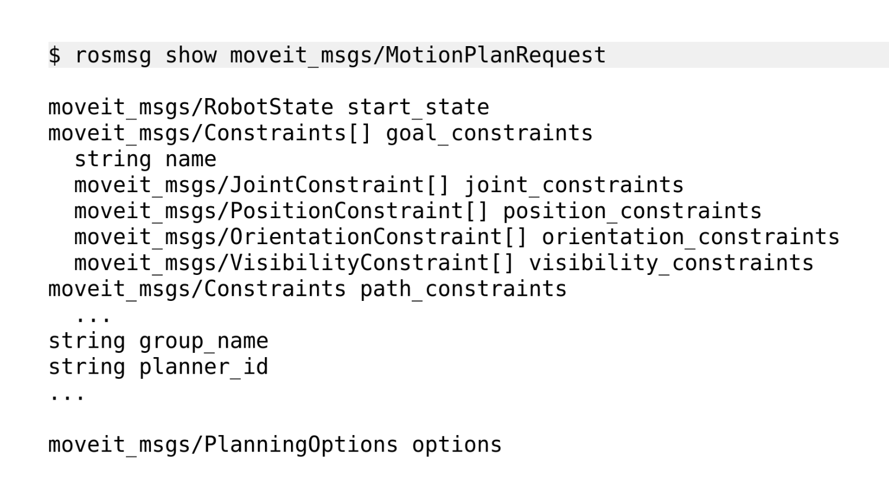

 
# MOVEIT - POPPING THE HOOD

---
 
# Specifying goals 
>(slide needs work, not sure what the intention here is)   

Typical Usage 

1. Joint Target
   - RViz display
   - Pre-specified poses
   - Default: 0.02 deg tolerance
2. Pose Targets
   - Most-requested application
   - MoveGroupInterface::setPoseTarget()
   - Default: 1mm 3 , 0.1 deg tolerance

Tolerances are intrinsic in the planning problem, not controlling.

---
 
# Robot Interface
https://moveit.ros.org/documentation/concepts/
>(slide needs work, not sure what the intention here is)   
- Joiint State Information `/joint_states` provided by Gazebo, ros_control or driver
- Transform Information TF and `robot_state_publisher`
- Controller Interface FollowJointTrajectory (provided by ros_control or driver or Gazebo)
- Planning Scene


---
 
# Motion Planning Pipeline


---
 
# Motion Planning Pipeline

You can pass a goal state request to the motion planner and it will generate a trajectory for you if it was succesfully able to compute one.   

The request consists of information like the current state, constraints (including the goal), attached objects etc...   

The response is a trajectory, which is a combination of the path to follow and the timing i.e.: velocity and acceleration specifications. 

---
 
# Motion Planning Pipeline - Request



---
 
# Motion Planning Pipeline - Response


`rosmsg show trajectory_msgs/JointTrajectory`
```
std_msgs/Header header
  uint32 seq
  time stamp
  string frame_id
string[] joint_names
trajectory_msgs/JointTrajectoryPoint[] points
  float64[] positions
  float64[] velocities
  float64[] accelerations
  float64[] effort
  duration time_from_start
```

---
 
# Motion Planning Pipeline


A request starts the Motion Planning Pipeline, which fixes some start state parameters like Joint state bounds, Workspace bounds, Collission checks, Path constraints, and then hands over to `PlannerManager`

Before starting the actual planning, MoveIt first needs information about the world so that it can generate valid trajectories. This is provided by the `PlanningScene`

---
 
# Planning Scene

<!-- http://docs.ros.org/kinetic/api/moveit_tutorials/html/doc/planning_scene_ros_api/planning_scene_ros_api_tutorial.html -->

This keeps track of the state of the world by collecting information such as :
1. Joint states from the robot & TF - should (ideally) be already provided by the robot driver, or could be setup with a `robot_state_publisher` type node manually.
2. Sensory input (2D/3D) - should be configured through configuration files and acquired through sensor drivers.
3. User input - provided by the user through API/CLI.

This information is used to build an occupancy map of the world using Octomap and is required to avoid collissions while planning.   

---
 
# Planning Scene

&nbsp;&nbsp;&nbsp;&nbsp;&nbsp;&nbsp;&nbsp;&nbsp;&nbsp;&nbsp;&nbsp;&nbsp;&nbsp;&nbsp;&nbsp;&nbsp;&nbsp;&nbsp;&nbsp;&nbsp;

---
 
# Planning Scene

The most common input that the user provides to the Planning Scene is information about collission objects that are either part of the world, or are attached to the robot. This is essential for proper collission avoidance during the planning phase. Other information about the scene such as link padding, object colors etc.. can also be provided.   


---
 
use one of the two following descriptions :

---
 
# Planning Scene
<style scoped>
p {
    font-size: 20px;
}
</style>

`rosmsg show moveit_msgs/PlanningScene --raw`   
```
# name of planning scene
string name

# full robot state
RobotState robot_state

# The name of the robot model this scene is for
string robot_model_name

#additional frames for duplicating tf (with respect to the planning frame)
geometry_msgs/TransformStamped[] fixed_frame_transforms

#full allowed collision matrix
AllowedCollisionMatrix allowed_collision_matrix
```

---
# Planning Scene(contd...)

```
# all link paddings
LinkPadding[] link_padding

# all link scales
LinkScale[] link_scale

# Colors for Attached objects, collision objects, octomap & collision map 
ObjectColor[] object_colors

# the collision map
PlanningSceneWorld world

# Flag, whether this scene is a diff w.r.t some other scene
bool is_diff
```

---
 
# Planning Scene


---
 
# Planning Scene

The 3 ways in which the user can provide this information to MoveIt are:
1. The service `/apply_planning_scene` (synchronous) 
2. The  topic `/planning_scene` (asynchronous)
3. Rviz GUI - add scene object using an .stl file.   

---
 
# Planning Scene
In the first two cases, the user must create a collission object using `moveit_msgs\AttachedCollisionObject` using geometric primitives and assigned a frame,along with the information to either attach or detach it.    

This object is packed inside a `moveit_msgs\PlanningScene` object, along with the name of the frame to which it is attached/detached (robot/world) and sent via the topic or the service.

---
 
# Planner Manager and OMPL

MoveIt can be configured to work with any planning library. The default used is Open Manipulation Planning Library (OMPL), but alternatives include CHOMP, STOMP, SBPL etc..   

OMPL consists of many planners, including: 

<!--### Sampling-based motion planners: -->
- Single-query (solve for only given problem): RRTConnect, RRT, KPIECE, ... . . .
- Multi-query (solves entire joint space, re-use): PRM, LazyPRM, . . .
- Optimizing (solves while optimizing for a metric like path): RRTstar, PRMstar, Bitstar, . . .

---
 
# Planning Scene

<!--http://ompl.kavrakilab.org/OMPL_Primer.pdf-->

|RRT|PRM|
|---|---|
|||

Most of the single query planners use Rapidly expanding Random Trees (RRT) to find a collission free path from a start state to a goal state whereas the multi query planners are based on Probability Road Maps (PRM).  


---
 
# Planning Scene

<!-- https://answers.ros.org/question/65286/does-ompl-generate-path-or-trajectory/ -->
The path generated in this way considers only collission avoidance and kinematics. The final step is post-processing, which performs time parametrization on this to generate a trajectory.

<!-- http://docs.ros.org/melodic/api/moveit_tutorials/html/doc/time_parameterization/time_parameterization_tutorial.html -->

--- 
 
# Collision Checking
<!-- Interesting read:  
https://www.toptal.com/game/video-game-physics-part-ii-collision-detection-for-solid-objects  
Use mainly resources..  
Mention interfaces -- services, topics, etc  
How to invoke collision checking -- API -->

Collision checking is performed within the Planning Scene, through the `CollissionWorld` object. Collision checking is perfomred automatically during planning and the user does not normally have to specifically invoke it. However, it can also be manually verified using `PlanningScene::checkCollission(request,response,robot_state)`. The API is provided by the Flexible Collision Library (FCL) used by MoveIt. This is a very versatile library, consisting many different types of algorithms, and can handle a large variety of collision checking queries. <!--http://gamma.cs.unc.edu/FCL/fcl_docs/webpage/pdfs/fcl_icra2012.pdf--> FCL returns not only the information about whether two objects are in collision, but also the colliding contact points. <!--https://ros-planning.github.io/moveit_tutorials/doc/visualizing_collisions/visualizing_collisions_tutorial.html#getting-started-->   

--- 
 
# Collision Checking - FCL


--- 
 
# Collision Objects

MoveIt supports collision checking for different types of objects including:
- Meshes
- Primitive Shapes - e.g. boxes, cylinders, cones, spheres and planes
- Octomap - the Octomap object can be directly used for collision checking
- Point clouds generated by sensors

--- 
 
# Allowed Collision Matrix (ACM)

Collision checking accounts for 90% of the computational expense. ACM holds information if collision checks need to be done between pairs of bodies. If two bodies can never be in collision, this can be specified inside ACM to save time. This is done by `collision_detection::AllowedCollisionMatrix::setEntry(first_body,second_body,true/false)`.


Moveit Setup Assistant performs a similar check for specifically the roboto with itself, and generates Self Collision Matrix.
 

---
 
# Kinematics
<!-- https://ros-planning.github.io/moveit_tutorials/doc/robot_model_and_robot_state/robot_model_and_robot_state_tutorial.html -->
Two important classes to consider when talking about Kinematics within MoveIt are :   

1. `RobotModel` - 
   * Contains information on relationships between links and joints, loaded from URDF. 
   * Contains information about planning groups, loaded from SRDF.
---
 
# Kinematics

2. `RobotState` -
    * Contains the state of the robot at a snapshot in time - joint positions, velocities and acceleration
    * Contains helper functions for setting the arm location based on the end effector location (Cartesian pose) and for computing Cartesian trajectories.

 
---
 
# Kinematics   

Forward Kinematics is fully integrated into MoveIt but Inverse Kinematics can be freely configured through plugins. `RobotState::getGlobalLinkTransform(ee_link)` can be invoked at any time to get the FK solution.  

The default IK solver used by MoveIt is the Kinematics & Dynamics Library (KDL), but users may use any other or even write their own. This is set in the `kinematics.yaml` file, where the default for KDL lools like `kdl_kinematics_plugin/KDLKinematicsPlugin`. To invoke IK, we cane use `RobotState::setFromIK(planning_group,ee_state,timeout)`.   

---
 
# Time parametrization

The output generated by OMPL is usually only a path. This needs to be converted into a trajectory. <!-- https://answers.ros.org/question/65286/does-ompl-generate-path-or-trajectory/ -->
This is done by a Trajectory Processing routine which takes into account the actual velocity and acceleration limits of the joints of the robot, which are read from `joint_limits.yaml`.    

---
 
# Time parametrization

Time parametrization can be done in one of 3 ways:   
1. Iteratiev Parabolic Time Parametrization (IPTP) - the default implementation in MoveIt
2. Iterative Spline Parametrization (ISP) - a more refined approach that tends to adjust start and end states
3. Time Optimal Trajectory Generation (TOTG) - a very recent development, focused towards optimizing the trajectory w.r.t. speed parameters within bounds

The output of this phase is a trajectory which can be forwarded through the FollowJointTrajectory action interface to the ROS driver of the robot.   


---
 
# Controllers

The final phase, once the trajectory is available, is for MoveIt to send it to the robot. This is done through the `FollowJointTrajectory` Action interface. 

Moveit automatically starts up a client of this interface, and tries to connect to the server, which needs to be provided by the ROS driver of the robot. This is configured in `controllers.yaml`.

The ROS driver then ensures that this trajectory is executed by the robot, the precise implementation of which varies widely from brand to brand.