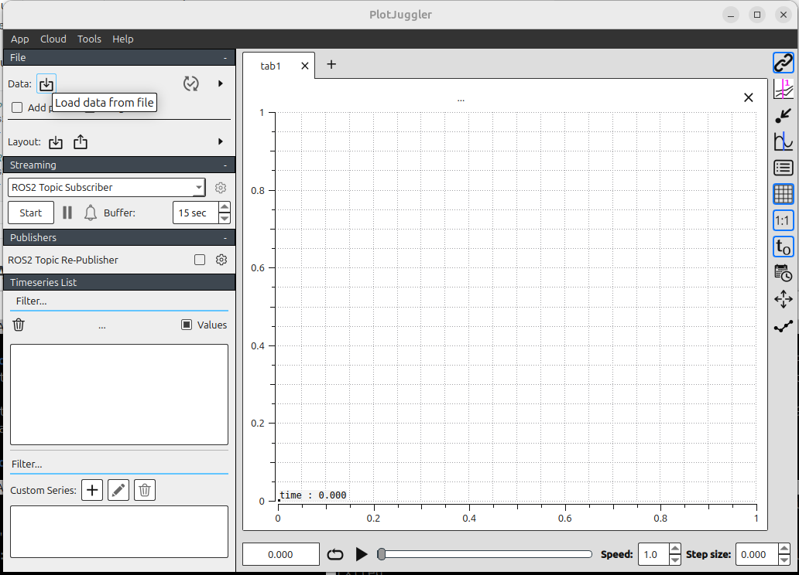
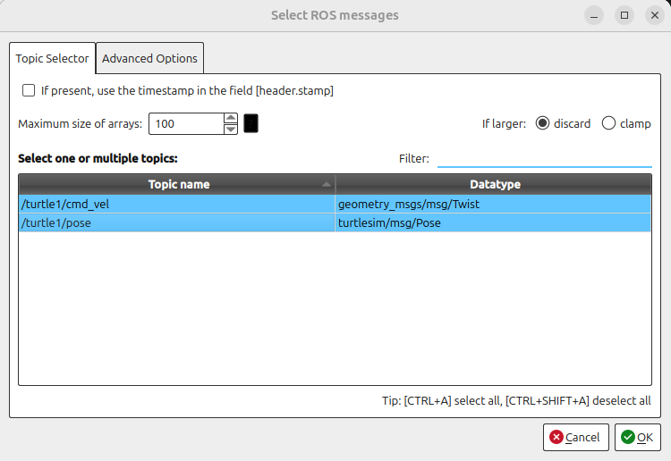
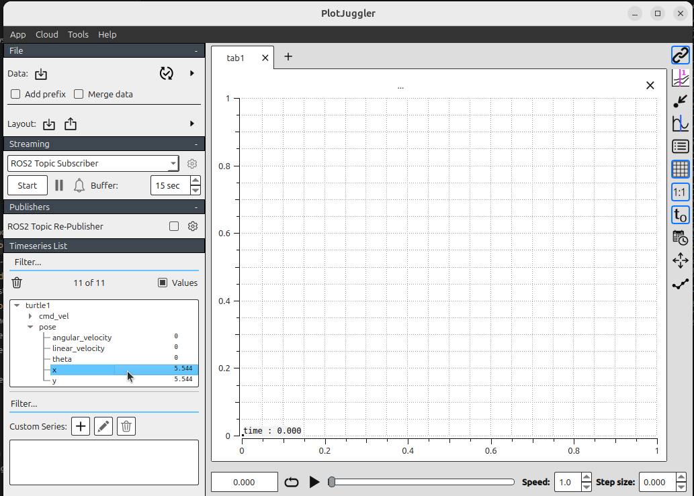

# ROS 2 bags and PlotJuggler

## 1. Introduction

A ROS 2 bag stores timestamped messages published on ROS topics. You can use a
bag to repeat an experiment, inspect what happened, or analyze signals without
running the original system again.

In this exercise, you will:

1. Record commands and poses from Turtlesim.
2. Inspect and replay the recording with `ros2 bag`.
3. Load the same bag into PlotJuggler and plot the recorded values.

## 2. Requirements

This exercise continues from [ROS 2 CLI and
Turtlesim](ROS2-CLI.md). Install the required packages if they are not already
available:

```bash
sudo apt update
sudo apt install ros-$ROS_DISTRO-turtlesim \
  ros-$ROS_DISTRO-rosbag2 \
  ros-$ROS_DISTRO-plotjuggler-ros
```

Source ROS 2 in every new terminal:

```bash
source /opt/ros/$ROS_DISTRO/setup.bash
```

## 3. Start Turtlesim

Start the simulator in the first terminal:

```bash
ros2 run turtlesim turtlesim_node
```

Start keyboard teleoperation in a second terminal:

```bash
ros2 run turtlesim turtle_teleop_key
```

Select the teleoperation terminal and verify that the arrow keys move the
turtle.

## 4. Record a bag

For this example, record two topics:

- `/turtle1/cmd_vel` contains the velocity commands sent to the turtle.
- `/turtle1/pose` contains the resulting position, orientation, and velocity.

In a third terminal, create a directory for the recordings and start recording:

```bash
mkdir -p ~/dev_ws/bags
cd ~/dev_ws/bags
ros2 bag record -o turtlesim_bag --topics \
  /turtle1/cmd_vel /turtle1/pose
```

Move the turtle for approximately 15 seconds. Include straight segments and
turns so that the plots contain varied data. Return to the recording terminal
and press `Ctrl+C` to stop.

The output name must be unique. If `turtlesim_bag` already exists, choose a new
name such as `turtlesim_bag_02`.

### 4.1 What was created?

The command creates a bag directory rather than a single file:

```text
turtlesim_bag/
├── metadata.yaml
└── turtlesim_bag_0.mcap
```

Depending on the configured storage plugin, the data file may use another
extension, such as `.db3`. The `metadata.yaml` file describes the storage
format, topics, message types, duration, and message counts.

## 5. Inspect the bag

Display a summary of the recording:

```bash
ros2 bag info ~/dev_ws/bags/turtlesim_bag
```

Check that both topics are listed and that each has a nonzero message count.
The pose topic normally contains more messages because Turtlesim publishes it
continuously, while the command topic is published when teleoperation sends a
command.

## 6. Replay the movement

Keep the simulator running, but stop the keyboard teleoperation node with
`Ctrl+C` so that it does not publish commands during playback. Reset the turtle
to its initial state:

```bash
ros2 service call /reset std_srvs/srv/Empty "{}"
```

Replay only the command topic:

```bash
ros2 bag play ~/dev_ws/bags/turtlesim_bag \
  --topics /turtle1/cmd_vel
```

The turtle should repeat approximately the same motion. Only the command topic
is replayed because `/turtle1/pose` is an observation, not a command. Replaying
the recorded pose would not move Turtlesim and would create a second publisher
for the topic while the simulator is running.

Useful playback options include:

```bash
# Play at half speed
ros2 bag play ~/dev_ws/bags/turtlesim_bag \
  --topics /turtle1/cmd_vel --rate 0.5

# Repeat until Ctrl+C is pressed
ros2 bag play ~/dev_ws/bags/turtlesim_bag \
  --topics /turtle1/cmd_vel --loop
```

Use `ros2 bag play --help` to see all options supported by your ROS 2 version.

## 7. Analyze the bag with PlotJuggler

PlotJuggler turns numeric fields from recorded messages into time series. It
can read the bag directly, so Turtlesim does not need to be running and you do
not need to play the bag first.

### 7.1 Start PlotJuggler

Launch PlotJuggler from a terminal in which ROS 2 is sourced:

```bash
sudo apt install ros-jazzy-plotjuggler-ros
ros2 run plotjuggler plotjuggler
```

The `plotjuggler-ros` package supplies the ROS 2 bag loader and message parser.

### 7.2 Load the recording

1. Select **Open data file** in PlotJuggler.

   

2. Open `~/dev_ws/bags/turtlesim_bag/metadata.yaml`. Select `metadata.yaml`, rather than the `.mcap` or `.db3` storage file, when
using the ROS 2 bag loader. The loader reads the metadata to locate the storage
file and determine its format.

3. In the topic-selection dialog, select `/turtle1/cmd_vel` and
   `/turtle1/pose`, then accept the selection.

   

4. Wait for the bag to load. The decoded numeric fields appear in the curve
   list on the left. You can then drag & drop the field to the grid.

   

### 7.3 Create useful plots

Drag fields from the curve list onto a plot area. Depending on the PlotJuggler
version, field names may use dots or slashes as separators. Look for these
message paths:

- `/turtle1/pose/x` and `/turtle1/pose/y`: position on the Turtlesim canvas.
- `/turtle1/pose/theta`: orientation in radians.
- `/turtle1/pose/linear_velocity` and
  `/turtle1/pose/angular_velocity`: measured motion.
- `/turtle1/cmd_vel/linear/x`: commanded forward velocity.
- `/turtle1/cmd_vel/angular/z`: commanded angular velocity.

Suggested layout:

1. Plot pose `x` and `y` together to compare how the position changes.
2. Plot `theta` in a separate panel because it uses radians.
3. Plot commanded `linear/x` with measured `linear_velocity`.
4. Plot commanded `angular/z` with measured `angular_velocity`.

Use the time slider, zoom controls, and tracker to inspect individual events.
Notice how changes in the command signals correspond to changes in the pose
and measured velocity.


## 9. Further reading

- [ROS 2: Recording and playing back
  data](https://docs.ros.org/en/jazzy/Tutorials/Beginner-CLI-Tools/Recording-And-Playing-Back-Data/Recording-And-Playing-Back-Data.html)
- [PlotJuggler ROS
  plugins](https://github.com/PlotJuggler/plotjuggler-ros-plugins)
