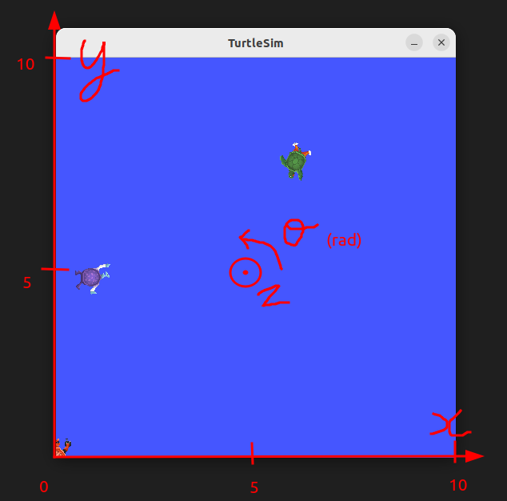

# ROS 2 CLI and Turtlesim

## 1. Introduction

The `ros2` command-line interface (CLI) lets you start nodes and inspect or
interact with a running ROS 2 system. Its subcommands cover nodes, topics,
services, actions, parameters, interfaces, and many other ROS 2 concepts.

Turtlesim is a small teaching application that makes these concepts visible.
In this tutorial, you will use the CLI to inspect and control a simulated
turtle. Try to find commands with `--help` and the [ROS 2 basics cheat
sheet](ROS2-Basics-CheatSheet.md) before consulting the solutions.

The official [ROS 2 Jazzy beginner CLI
tutorials](https://docs.ros.org/en/jazzy/Tutorials/Beginner-CLI-Tools.html)
provide additional examples.

### 1.1 Requirements

Install Turtlesim if it is not already available:

```bash
sudo apt update
sudo apt install ros-$ROS_DISTRO-turtlesim
```

Source ROS 2 in every new terminal:

```bash
source /opt/ros/$ROS_DISTRO/setup.bash
```

Display the available CLI subcommands:

```bash
ros2 --help
```

Most commands provide more detailed help:

```bash
ros2 topic --help
ros2 topic echo --help
```

## 2. ROS 2 communication patterns

ROS 2 uses three principal communication patterns:

| Interface | Pattern | Typical use |
| --- | --- | --- |
| Topic | Publisher/subscriber | Continuous streams of data |
| Service | Request/response | Short operations that return one response |
| Action | Goal/feedback/result | Longer operations that can provide feedback and be cancelled |

Messages, services, and actions are described by interface definitions. List
the installed interfaces and inspect one with:

```bash
ros2 interface list
ros2 interface show geometry_msgs/msg/Twist
```

## 3. Start Turtlesim

The general form for starting an executable is:

```text
ros2 run PACKAGE EXECUTABLE
```

Start the simulator in one terminal:

```bash
ros2 run turtlesim turtlesim_node
```

Start keyboard teleoperation in another terminal:

```bash
ros2 run turtlesim turtle_teleop_key
```

A Qt window should open with a blue background and a turtle in the middle.
Treat it as an automated guided vehicle observed from above.



You can keep the simulator visible by right-clicking its title bar and enabling
**Always on top**. Select the teleoperation terminal and use the arrow keys to
move the turtle. The other listed keys set absolute orientations.

## 4. Inspect the ROS graph

With both Turtlesim nodes running, use the CLI to discover the nodes, topics,
services, actions, parameters, and their interface types.

### 4.1 Nodes

List the running nodes:

```bash
ros2 node list
```

Inspect the simulator node:

```bash
ros2 node info /turtlesim
```

Node names should be unique within a ROS graph. ROS 2 can start nodes with the
same name, but doing so makes introspection and communication ambiguous.

### 4.2 Topics

List topics and their types:

```bash
ros2 topic list -t
```

Inspect the velocity command topic:

```bash
ros2 topic type /turtle1/cmd_vel
ros2 topic info /turtle1/cmd_vel --verbose
ros2 interface show geometry_msgs/msg/Twist
```

Display messages and measure their publication frequency and bandwidth:

```bash
ros2 topic echo /turtle1/pose
ros2 topic hz /turtle1/pose
ros2 topic bw /turtle1/pose
```

The main Turtlesim topics are:

- `/turtle1/color_sensor` reports the RGB values of the trail color.
- `/turtle1/cmd_vel` receives commands that move the turtle. Echo this topic
  while using keyboard teleoperation to observe the velocity commands.
- `/turtle1/pose` reports the turtle's current position and orientation.

### 4.3 Services

List services and their types:

```bash
ros2 service list -t
```

Inspect a service type and its request fields:

```bash
ros2 service type /spawn
ros2 interface show turtlesim/srv/Spawn
ros2 interface proto turtlesim/srv/Spawn
```

The main Turtlesim services are:

- `/kill` and `/spawn` remove and create turtles.
- `/clear` removes trail lines, while `/reset` restores the initial state.
- `/turtle1/set_pen` changes the trail color and thickness.
- `/turtle1/teleport_absolute` and `/turtle1/teleport_relative` move the
  turtle instantly.

The services containing `parameter` in their names support the node's
parameter API. You can ignore them until the parameter exercise below.

### 4.4 Actions

List action servers and inspect the rotate action:

```bash
ros2 action list -t
ros2 action info /turtle1/rotate_absolute
ros2 interface show turtlesim/action/RotateAbsolute
```

Actions are appropriate for operations that take time and may need feedback or
cancellation.

### 4.5 Parameters

List, read, and describe parameters:

```bash
ros2 param list
ros2 param get /turtlesim background_r
ros2 param describe /turtlesim background_r
```

Save all parameters from the node to a YAML file:

```bash
ros2 param dump /turtlesim
```

In the next module, repeat these introspection activities with `rqt` and
`rqt_graph` and compare the graphical view with the CLI output.

## 5. Interact with Turtlesim

### 5.1 Publish a topic

Stop the keyboard teleoperation node before publishing your own velocity
commands. The `Twist` message contains two nested `Vector3` values named
`linear` and `angular`.

Publish a velocity command at 2 Hz:

```bash
ros2 topic pub --rate 2 /turtle1/cmd_vel geometry_msgs/msg/Twist \
  "{linear: {x: 0.5}, angular: {z: 0.5}}"
```

Stop a continuous publisher with `Ctrl+C`. To publish only once, replace
`--rate 2` with `--once`.

### 5.2 Call services

Service request values use YAML syntax and must match the fields and types in
the service interface. First, change the turtle's pen color:

```bash
ros2 service call /turtle1/set_pen turtlesim/srv/SetPen \
  "{r: 100, g: 0, b: 0, width: 2, 'off': 0}"
```

Move the turtle and echo `/turtle1/color_sensor` to compare its output with the
chosen RGB values.

Inspect and call the empty `/clear` service:

```bash
ros2 service type /clear
ros2 interface show std_srvs/srv/Empty
ros2 service call /clear std_srvs/srv/Empty "{}"
```

Spawn a second turtle:

```bash
ros2 service call /spawn turtlesim/srv/Spawn \
  "{x: 1.0, y: 5.0, theta: 0.0, name: second_turtle}"
```

Remove the second turtle:

```bash
ros2 service call /kill turtlesim/srv/Kill \
  "{name: second_turtle}"
```

### 5.3 Send an action goal

The rotate action accepts an angle in radians. Send a goal and display its
feedback:

```bash
ros2 action send_goal /turtle1/rotate_absolute \
  turtlesim/action/RotateAbsolute "{theta: -1.57}" --feedback
```

### 5.4 Change parameters

The background color parameters accept values from 0 to 255. Change one of
them:

```bash
ros2 param set /turtlesim background_r 125
```

The parameter services can also be inspected and called directly:

```bash
ros2 service type /turtlesim/list_parameters
ros2 interface show rcl_interfaces/srv/ListParameters
ros2 service call /turtlesim/list_parameters \
  rcl_interfaces/srv/ListParameters "{prefixes: [], depth: 0}"
```

## 6. Next: record and analyze Turtlesim data

Continue with [ROS 2 bags and PlotJuggler](ROS2-Bags-PlotJuggler.md) to record
Turtlesim commands and poses, replay the movement, and inspect the recorded
signals in PlotJuggler.

## 7. Remapping and runtime options

ROS-specific arguments follow `--ros-args`. Rename a node at runtime:

```bash
ros2 run turtlesim turtlesim_node --ros-args \
  --remap __node:=workshop_turtlesim
```

Remap the command topic for both Turtlesim nodes:

```bash
ros2 run turtlesim turtlesim_node --ros-args \
  --remap /turtle1/cmd_vel:=/robot/cmd_vel
```

In another terminal:

```bash
ros2 run turtlesim turtle_teleop_key --ros-args \
  --remap /turtle1/cmd_vel:=/robot/cmd_vel
```

The nodes still communicate because the original topic is mapped to the same
new name in both processes.

Every command and subcommand provides options through `-h` or `--help`. For
example, `--rate 0.5` publishes or calls at 0.5 Hz. When repeatedly calling
`/spawn`, omit the `name` field so that Turtlesim can assign unique names.

## 8. Practice

Use only the CLI and its built-in help to complete these tasks:

1. Find the names of all running nodes.
2. Determine the type of `/turtle1/pose` and inspect its fields.
3. Measure the publication rate of `/turtle1/pose`.
4. Find the request fields of the `/spawn` service and spawn a turtle.
5. Change the pen color, then verify it through `/turtle1/color_sensor`.
6. Find the goal, result, and feedback fields of the rotate action, then send a
   goal.
7. Change one background-color parameter.
8. Publish a velocity command at 0.5 Hz.
9. Call `/reset` and observe the result.

Use tab completion, `--help`, `ros2 interface show`, and `ros2 interface proto`
when you are uncertain about a command.

## 9. Solutions

### 9.1 Inspect the graph

```bash
ros2 node list
ros2 topic list -t
ros2 topic type /turtle1/pose
ros2 interface show turtlesim/msg/Pose
ros2 topic hz /turtle1/pose
ros2 service list -t
ros2 interface show turtlesim/srv/Spawn
ros2 interface proto turtlesim/srv/Spawn
```

### 9.2 Interact with the turtle

```bash
ros2 service call /spawn turtlesim/srv/Spawn \
  "{x: 5.0, y: 5.0, theta: 0.0}"

ros2 service call /turtle1/set_pen turtlesim/srv/SetPen \
  "{r: 100, g: 0, b: 0, width: 2, 'off': 0}"

ros2 action send_goal /turtle1/rotate_absolute \
  turtlesim/action/RotateAbsolute "{theta: -1.57}" --feedback

ros2 param set /turtlesim background_r 125

ros2 topic pub --rate 0.5 /turtle1/cmd_vel geometry_msgs/msg/Twist \
  "{linear: {x: 0.5}, angular: {z: 0.5}}"

ros2 service call /reset std_srvs/srv/Empty "{}"
```
