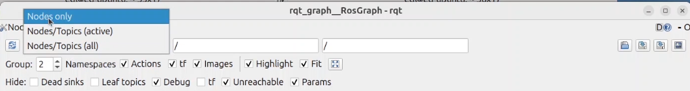
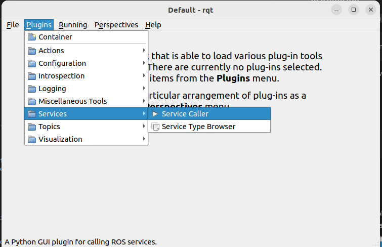
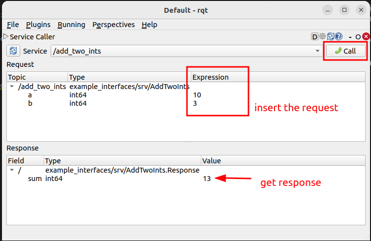

# ROS 2 GUI tools: rqt and rqt_graph

## 1. Introduction

`rqt` is a graphical framework that hosts ROS 2 tools as plugins.
`rqt_graph` visualizes the active nodes and the topics connecting them. These
tools complement the ROS 2 CLI and are useful when developing or debugging a
system.

See the official [RQt overview and usage
guide](https://docs.ros.org/en/jazzy/Concepts/Intermediate/About-RQt.html) for
more information.

## 2. Install the tools

The ROS 2 desktop installation normally includes rqt. If the commands are
missing, install the framework and its common plugins:

```bash
sudo apt update
sudo apt install ros-$ROS_DISTRO-rqt ros-$ROS_DISTRO-rqt-common-plugins
```

## 3. Prepare an example graph

Start Turtlesim in one terminal:

```bash
ros2 run turtlesim turtlesim_node
```

Start keyboard control in a second terminal:

```bash
ros2 run turtlesim turtle_teleop_key
```

## 4. Explore rqt

Start the plugin framework:

```bash
rqt
```

Plugins are available from the **Plugins** menu. Useful plugins include:

- **Introspection → Node Graph**
- **Services → Service Caller**
- **Topics → Topic Monitor**
- **Configuration → Dynamic Reconfigure**, when supported by the node

The exact menu contents depend on the rqt packages installed on the computer.

## 5. Visualize nodes with rqt_graph

Open the graph as a standalone tool:

```bash
rqt_graph
```

Alternatively, open **Introspection → Node Graph** from the rqt Plugins menu.
With Turtlesim and keyboard teleoperation running, the graph shows the
`/teleop_turtle` and `/turtlesim` nodes connected through
`/turtle1/cmd_vel`.



Use the controls above the graph to:

- refresh discovery
- include or hide topics
- filter namespaces
- show active connections only

Move the turtle with the keyboard and compare the graph with:

```bash
ros2 node info /teleop_turtle
ros2 node info /turtlesim
```

## 6. Call a service from rqt

Open **Services → Service Caller**. Select the `/spawn` service and enter
values for `x`, `y`, `theta`, and `name`.



Press **Call** to send the request. The response contains the name of the
created turtle.



Compare this operation with the equivalent CLI command:

```bash
ros2 service call /spawn turtlesim/srv/Spawn \
  "{x: 2.0, y: 2.0, theta: 0.0, name: second_turtle}"
```

## 7. Exercise

1. Run the publisher and subscriber created in the previous exercise.
2. Open `rqt_graph` and locate both nodes and their shared topic.
3. Stop the subscriber and refresh the graph.
4. Restart it and verify that the connection returns.
5. Use a topic-related rqt plugin to inspect the published values.
6. Start Turtlesim and call one of its services through rqt.

Use the CLI to cross-check what the GUI shows:

```bash
ros2 node list
ros2 topic list -t
ros2 service list -t
```
