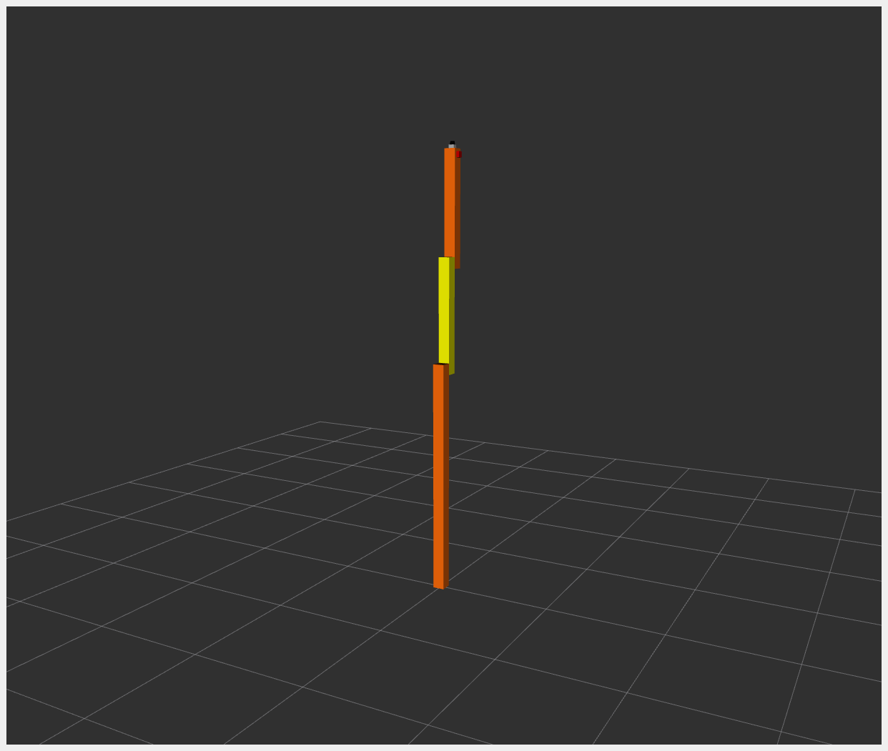

# RRBot

****

**RRBot**, or *Revolute-Revolute Manipulator Robot*, is a simple 3-linkage, 2-joint arm used to demonstrate various features.

It is essentially a double inverted pendulum and demonstrates some control concepts within a simulator. It was originally introduced for Gazebo tutorials.

For *example\_1*, the hardware interface plugin is implemented with only one interface:

* Communication is done using proprietary API to communicate with the robot control box.
* Data for all joints is exchanged at once.
* Example: KUKA RSI

The **RRBot** URDF files can be found in the `description/urdf` folder.

## Tutorial Steps

### 0. Prerequisites

Ensure you have the following packages installed:

```sh
cd
mkdir -p colcon_control_ws/src
cd colcon_control_ws/src
git clone -b demo/tricycle https://github.com/ipa-vsp/ros2_control_demos.git
cd ..
rosdep install --from-paths src -iry
colcon build --symlink-install
source install/setup.bash
```

### 1. Check RRBot Description Launch

(Optional) To verify that RRBot descriptions are working properly, run:

```sh
ros2 launch ros2_control_demo_example_1 view_robot.launch.py
```

In another terminal, launch the GUI:

```sh
source /opt/ros/${ROS_DISTRO}/setup.bash
ros2 run joint_state_publisher_gui joint_state_publisher_gui
```

Start RViz:

```sh
source /opt/ros/${ROS_DISTRO}/setup.bash
rviz2 -d src/ros2_control_demos/ros2_control_demo_description/rrbot/rviz/rrbot.rviz
```

> **Note**: Warning `Invalid frame ID "odom" passed to canTransform` is expected. It happens while `joint_state_publisher_gui` is starting.



Once working, stop RViz using `CTRL+C`.

### 2. Start RRBot Launch

```sh
ros2 launch ros2_control_demo_example_1 rrbot.launch.py
```

This starts the robot hardware, controllers, and opens RViz. If you see two orange and one yellow rectangle in RViz, it is working.

### 3. Check Hardware Interface

```sh
ros2 control list_hardware_interfaces
```

Expected output:

```sh
command interfaces
      joint1/position [available] [claimed]
      joint2/position [available] [claimed]
state interfaces
      joint1/position
      joint2/position
```

### 4. Check Running Controllers

```sh
ros2 control list_controllers
```

Expected output:

```sh
joint_state_broadcaster[joint_state_broadcaster/JointStateBroadcaster] active
forward_position_controller[forward_command_controller/ForwardCommandController] active
```

### 5. Send Commands

**a. Using CLI:**

```sh
ros2 topic pub /forward_position_controller/commands std_msgs/msg/Float64MultiArray "data:
- 0.5
- 0.5"
```

**b. Using Demo Node:**

```sh
ros2 launch ros2_control_demo_example_1 test_forward_position_controller.launch.py
```

You should see motion in RViz and terminal logs like:

```sh
[INFO] Writing commands:
  0.50 for joint 'joint2/position'
  0.50 for joint 'joint1/position'
```

To verify joint state outputs:

```sh
ros2 topic echo /joint_states
ros2 topic echo /dynamic_joint_states
```

### 6. Switch to Joint Trajectory Controller

Load controller:

```sh
ros2 control load_controller joint_trajectory_position_controller $(ros2 pkg prefix ros2_control_demo_example_1 --share)/config/rrbot_jtc.yaml
```

List controllers:

```sh
ros2 control list_controllers
```

Expected:

```sh
joint_state_broadcaster[...] active
forward_position_controller[...] active
joint_trajectory_position_controller[...] unconfigured
```

Configure controller:

```sh
ros2 control set_controller_state joint_trajectory_position_controller inactive
```

Alternatively:

```sh
ros2 control load_controller --set-state inactive joint_trajectory_position_controller $(ros2 pkg prefix ros2_control_demo_example_1 --share)/config/rrbot_jtc.yaml
```

Activate controller:

```sh
ros2 control switch_controllers --activate joint_trajectory_position_controller --deactivate forward_position_controller
```

Verify:

```sh
ros2 control list_controllers
```

Should return:

```sh
joint_state_broadcaster[...] active
forward_position_controller[...] inactive
joint_trajectory_position_controller[...] active
```

Launch demo node:

```sh
ros2 launch ros2_control_demo_example_1 test_joint_trajectory_controller.launch.py
```

### 7. Use rqt\_joint\_trajectory\_controller GUI

```sh
ros2 control load_controller joint_trajectory_position_controller $(ros2 pkg prefix ros2_control_demo_example_1 --share)/config/rrbot_jtc.yaml --set-state inactive && ros2 control switch_controllers --activate joint_trajectory_position_controller --deactivate forward_position_controller
```

Launch GUI:

```sh
ros2 run rqt_joint_trajectory_controller rqt_joint_trajectory_controller
```

Features:

* Dropdown to select controller
* Sliders to set joint positions
* Control execution time
* Send trajectory commands

## Files Used for This Demo

* **Launch file**: [rrbot.launch.py](https://github.com/ros-controls/ros2_control_demos/tree/master/example_1/bringup/launch/rrbot.launch.py)
* **Controllers YAML**:

  * [rrbot\_controllers.yaml](https://github.com/ros-controls/ros2_control_demos/tree/master/example_1/bringup/config/rrbot_controllers.yaml)
  * [rrbot\_jtc.yaml](https://github.com/ros-controls/ros2_control_demos/tree/master/example_1/bringup/config/rrbot_jtc.yaml)
* **URDF files**:

  * [rrbot.urdf.xacro](https://github.com/ros-controls/ros2_control_demos/tree/master/example_1/description/urdf/rrbot.urdf.xacro)
  * [rrbot\_description.urdf.xacro](https://github.com/ros-controls/ros2_control_demos/tree/master/ros2_control_demo_description/rrbot/urdf/rrbot_description.urdf.xacro)
  * [rrbot.ros2\_control.xacro](https://github.com/ros-controls/ros2_control_demos/tree/master/example_1/description/ros2_control/rrbot.ros2_control.xacro)
* **RViz config**: [rrbot.rviz](https://github.com/ros-controls/ros2_control_demos/tree/master/ros2_control_demo_description/rrbot/rviz/rrbot.rviz)
* **Test configs**:

  * [rrbot\_forward\_position\_publisher](https://github.com/ros-controls/ros2_control_demos/tree/master/example_1/bringup/config/rrbot_forward_position_publisher.yaml)
  * [rrbot\_joint\_trajectory\_publisher](https://github.com/ros-controls/ros2_control_demos/tree/master/example_1/bringup/config/rrbot_joint_trajectory_publisher.yaml)
* **Hardware interface**: [rrbot.cpp](https://github.com/ros-controls/ros2_control_demos/tree/master/example_1/hardware/rrbot.cpp)

## Controllers in This Demo

* **Joint State Broadcaster** ([docs](https://github.com/ros-controls/ros2_controllers/tree/master/joint_state_broadcaster))
* **Forward Command Controller** ([docs](https://github.com/ros-controls/ros2_controllers/tree/master/forward_command_controller))
* **Joint Trajectory Controller** ([docs](https://github.com/ros-controls/ros2_controllers/tree/master/joint_trajectory_controller))
