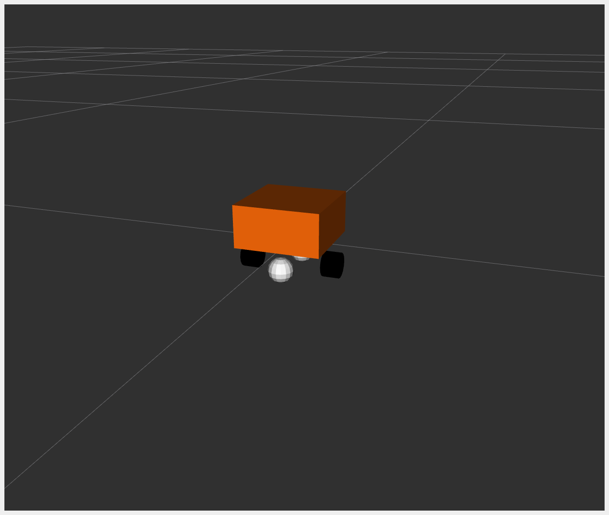

# DiffBot

**DiffBot**, or *Differential Mobile Robot*, is a simple mobile base with differential drive. It is essentially a box that moves according to differential drive kinematics.

For *example\_2*, the hardware interface plugin is implemented with only one interface:

* Communication is done using a proprietary API to communicate with the robot control box.
* Data for all joints is exchanged at once.

The **DiffBot** URDF files can be found in the `description/urdf` folder.

## Tutorial Steps

### 1. Check DiffBot Description Launch

To verify that DiffBot descriptions are working properly, run:

```sh
ros2 launch ros2_control_demo_example_2 view_robot.launch.py
```

> **Warning**: Output like `Warning: Invalid frame ID "odom" passed to canTransform` is expected. It happens while `joint_state_publisher_gui` is starting.



### 2. Start DiffBot Launch

```sh
ros2 launch ros2_control_demo_example_2 diffbot.launch.py
```

This starts the robot hardware, controllers, and opens RViz. You will see internal state logs in the terminal—these are for demonstration only and should be avoided in production code.

If you see an orange box in RViz, everything has started properly.

### 3. Check Hardware Interface

```sh
ros2 control list_hardware_interfaces
```

Expected output:

```sh
command interfaces
      left_wheel_joint/velocity [available] [claimed]
      right_wheel_joint/velocity [available] [claimed]
state interfaces
      left_wheel_joint/position
      left_wheel_joint/velocity
      right_wheel_joint/position
      right_wheel_joint/velocity
```

The `[claimed]` marker means a controller has access to command **DiffBot**. The interface type is `velocity`, typical for differential drive.

### 4. Check Controllers

```sh
ros2 control list_controllers
```

Expected output:

```sh
diffbot_base_controller[diff_drive_controller/DiffDriveController] active
joint_state_broadcaster[joint_state_broadcaster/JointStateBroadcaster] active
```

### 5. Send Commands to Diff Drive Controller

```sh
ros2 topic pub --rate 10 /cmd_vel geometry_msgs/msg/TwistStamped "
  header: auto
  twist:
    linear:
      x: 0.7
      y: 0.0
      z: 0.0
    angular:
      x: 0.0
      y: 0.0
      z: 1.0"
```

You should now see an orange box circling in RViz and terminal logs like:

```sh
[INFO] Writing commands:
  command 43.33 for 'left_wheel_joint'!
  command 50.00 for 'right_wheel_joint'!
```

### 6. Introspect Hardware Component

```sh
ros2 control list_hardware_components
```

Expected output:

```sh
Hardware Component 1
        name: DiffBot
        type: system
        plugin name: ros2_control_demo_example_2/DiffBotSystemHardware
        state: id=3 label=active
        command interfaces
                left_wheel_joint/velocity [available] [claimed]
                right_wheel_joint/velocity [available] [claimed]
```

To test with mock hardware (useful if simulator is unavailable), restart with:

```sh
ros2 launch ros2_control_demo_example_2 diffbot.launch.py use_mock_hardware:=True
```

Then run:

```sh
ros2 control list_hardware_components
```

Expected output:

```sh
Hardware Component 1
    name: DiffBot
    type: system
    plugin name: mock_components/GenericSystem
    state: id=3 label=active
    command interfaces
            left_wheel_joint/velocity [available] [claimed]
            right_wheel_joint/velocity [available] [claimed]
```

This shows a different plugin was loaded. Check `diffbot.ros2_control.xacro` to see:

```xml
<hardware>
  <plugin>mock_components/GenericSystem</plugin>
  <param name="calculate_dynamics">true</param>
</hardware>
```

This enables integration of velocity commands into position state, visible in `/joint_states`. Position should increase over time while moving.

## Files Used for This Demo

* **Launch file**: [diffbot.launch.py](https://github.com/ros-controls/ros2_control_demos/tree/master/example_2/bringup/launch/diffbot.launch.py)
* **Controllers YAML**: [diffbot\_controllers.yaml](https://github.com/ros-controls/ros2_control_demos/tree/master/example_2/bringup/config/diffbot_controllers.yaml)
* **URDF files**:

  * [diffbot.urdf.xacro](https://github.com/ros-controls/ros2_control_demos/tree/master/example_2/description/urdf/diffbot.urdf.xacro)
  * [diffbot\_description.urdf.xacro](https://github.com/ros-controls/ros2_control_demos/tree/master/ros2_control_demo_description/diffbot/urdf/diffbot_description.urdf.xacro)
  * [diffbot.ros2\_control.xacro](https://github.com/ros-controls/ros2_control_demos/tree/master/example_2/description/ros2_control/diffbot.ros2_control.xacro)
* **RViz config**: [diffbot.rviz](https://github.com/ros-controls/ros2_control_demos/tree/master/ros2_control_demo_description/diffbot/rviz/diffbot.rviz)
* **Hardware interface plugin**: [diffbot\_system.cpp](https://github.com/ros-controls/ros2_control_demos/tree/master/example_2/hardware/diffbot_system.cpp)

## Controllers in This Demo

* **Joint State Broadcaster** ([docs](https://github.com/ros-controls/ros2_controllers/tree/master/joint_state_broadcaster))
* **Diff Drive Controller** ([docs](https://github.com/ros-controls/ros2_controllers/tree/master/diff_drive_controller))
