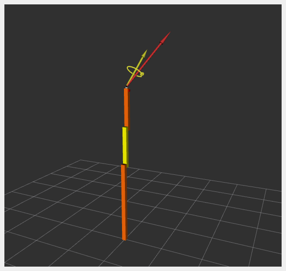

# Industrial Robot with Externally Connected Sensor

This example shows how an externally connected sensor can be accessed:

* Communication is done using a proprietary API to interface with the robot control box.
* Joint data are exchanged simultaneously.
* Sensor data are exchanged independently of joint data.
* Examples: KUKA RSI and FTS connected to independent PC with ROS 2.

A 3D Force-Torque Sensor (FTS) is simulated using a `SensorInterface` that generates random sensor readings.

## Tutorial Steps

### 1. Launch RRBot Visualization

```sh
ros2 launch ros2_control_demo_example_5 view_robot.launch.py
```

> **Note**: Warning `Invalid frame ID "odom"` is expected while `joint_state_publisher_gui` initializes. It provides a GUI to set a random configuration for RRBot, shown in RViz.

### 2. Launch RRBot with External Sensor

```sh
ros2 launch ros2_control_demo_example_5 rrbot_system_with_external_sensor.launch.py
```

This starts the robot hardware, controllers, and opens RViz. Console output will include internal state logs (for demonstration only).

If RViz shows two orange and one yellow rectangles, the system has started correctly.

### 3. Verify Hardware Interfaces

```sh
ros2 control list_hardware_interfaces
```

Expected output:

```sh
command interfaces
  joint1/position [available] [claimed]
  joint2/position [available] [claimed]
state interfaces
  joint1/position
  joint2/position
  tcp_fts_sensor/force.x
  tcp_fts_sensor/force.y
  tcp_fts_sensor/force.z
  tcp_fts_sensor/torque.x
  tcp_fts_sensor/torque.y
```

Check hardware components:

```sh
ros2 control list_hardware_components
```

Expected output:

```sh
Hardware Component 1
    name: ExternalRRBotFTSensor
    type: sensor
    plugin name: ros2_control_demo_example_5/ExternalRRBotForceTorqueSensorHardware
    state: id=3 label=active
    command interfaces
Hardware Component 2
    name: RRBotSystemPositionOnly
    type: system
    plugin name: ros2_control_demo_example_5/RRBotSystemPositionOnlyHardware
    state: id=3 label=active
    command interfaces
        joint1/position [available] [claimed]
        joint2/position [available] [claimed]
```

### 4. Check Running Controllers

```sh
ros2 control list_controllers
```

Expected output:

```sh
forward_position_controller[forward_command_controller/ForwardCommandController] active
fts_broadcaster[force_torque_sensor_broadcaster/ForceTorqueSensorBroadcaster] active
joint_state_broadcaster[joint_state_broadcaster/JointStateBroadcaster] active
```

### 5. Send Commands to RRBot

**a. Manual Control:**

```sh
ros2 topic pub /forward_position_controller/commands std_msgs/msg/Float64MultiArray "data:
- 0.5
- 0.5"
```

**b. Using Demo Node:**

```sh
ros2 launch ros2_control_demo_example_5 test_forward_position_controller.launch.py
```

Example log output:

```sh
[INFO] Writing commands:
  0.50 for joint 'joint1'
  0.50 for joint 'joint2'
```

### 6. Access Force-Torque Sensor Data

```sh
ros2 topic echo /fts_broadcaster/wrench
```

Expected output:

```yaml
header:
  stamp:
    sec: 1676444704
    nanosec: 332221422
  frame_id: tool_link
wrench:
  force:
    x: 1.21
    y: 2.32
    z: 3.43
  torque:
    x: 4.54
    y: 0.65
    z: 1.76
```

Sensor data is visualized in RViz:



## Files Used for This Demo

* **Launch file**: [rrbot\_system\_with\_external\_sensor.launch.py](https://github.com/ros-controls/ros2_control_demos/tree/master/example_5/bringup/launch/rrbot_system_with_external_sensor.launch.py)
* **Controllers YAML**: [rrbot\_with\_external\_sensor\_controllers.yaml](https://github.com/ros-controls/ros2_control_demos/tree/master/example_5/bringup/config/rrbot_with_external_sensor_controllers.yaml)
* **URDF**:

  * [rrbot\_with\_external\_sensor\_controllers.urdf.xacro](https://github.com/ros-controls/ros2_control_demos/blob/master/example_5/description/urdf/rrbot_system_with_external_sensor.urdf.xacro)
  * [rrbot\_description.urdf.xacro](https://github.com/ros-controls/ros2_control_demos/tree/master/ros2_control_demo_description/rrbot/urdf/rrbot_description.urdf.xacro)
  * [rrbot\_system\_position\_only.ros2\_control.xacro](https://github.com/ros-controls/ros2_control_demos/tree/master/example_5/description/ros2_control/rrbot_system_position_only.ros2_control.xacro)
  * [external\_rrbot\_force\_torque\_sensor.ros2\_control.xacro](https://github.com/ros-controls/ros2_control_demos/tree/master/example_5/description/ros2_control/external_rrbot_force_torque_sensor.ros2_control.xacro)
* **RViz Config**: [rrbot.rviz](https://github.com/ros-controls/ros2_control_demos/tree/master/example_5/description/rviz/rrbot.rviz)
* **Hardware Interface Plugins**:

  * [rrbot.cpp (robot)](https://github.com/ros-controls/ros2_control_demos/tree/master/example_5/hardware/rrbot.cpp)
  * [external\_rrbot\_force\_torque\_sensor.cpp (sensor)](https://github.com/ros-controls/ros2_control_demos/tree/master/example_5/hardware/external_rrbot_force_torque_sensor.cpp)

## Controllers in This Demo

* **Joint State Broadcaster** ([docs](https://github.com/ros-controls/ros2_controllers/tree/master/joint_state_broadcaster))
* **Forward Command Controller** ([docs](https://github.com/ros-controls/ros2_controllers/tree/master/forward_command_controller))
* **Force Torque Sensor Broadcaster** ([docs](https://github.com/ros-controls/ros2_controllers/tree/master/force_torque_sensor_broadcaster))
