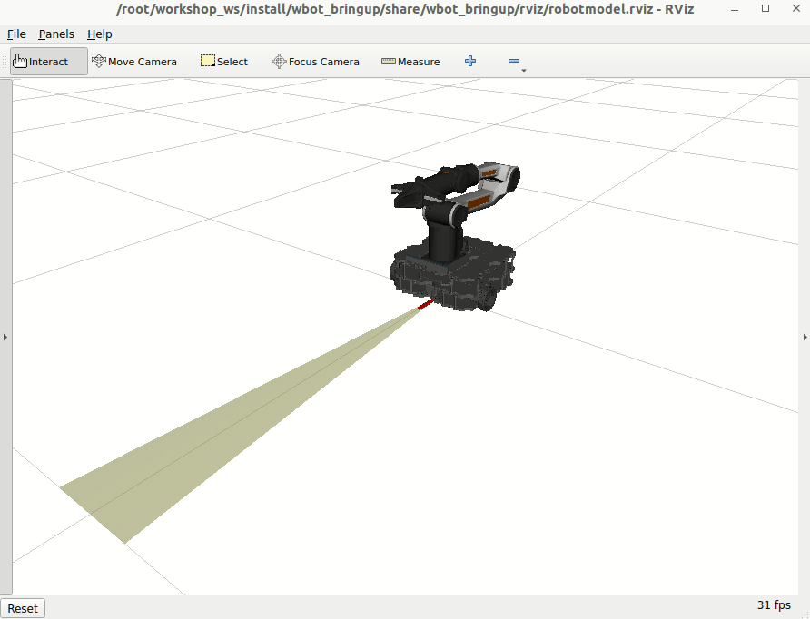
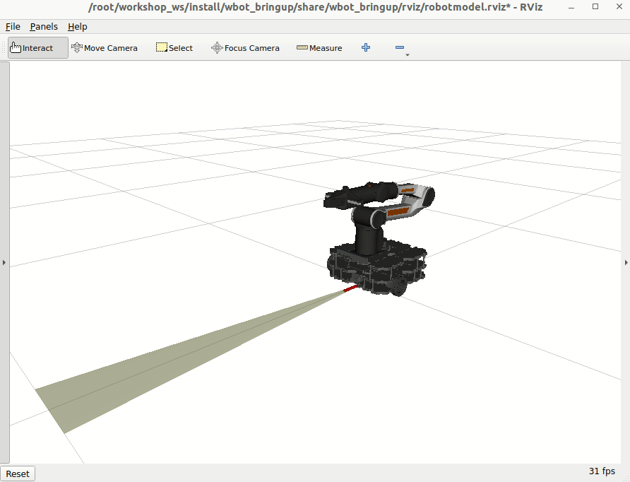
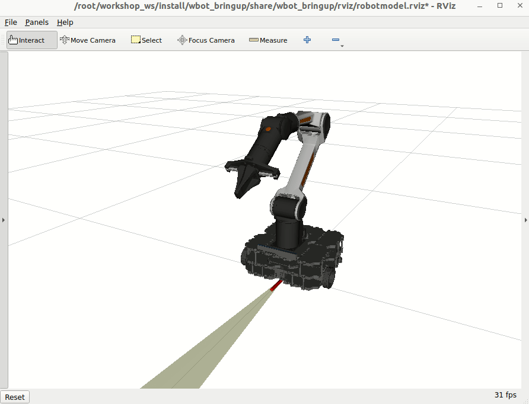

# WBot Mobile Manipulator Example

Bring up and control the WBot differential-drive base and 6-DoF arm with `ros2_control`. This example covers setup, launch, teleop, controller introspection, and mixing real base hardware with a mock arm.



## 0. Setup (one time)

```sh
sudo apt install git-lfs
git lfs install

mkdir -p ~/colcon_control_ws/src
cd ~/colcon_control_ws/src
git clone https://github.com/ROSI-IPA/wbot.git
git clone https://github.com/MarqRazz/piper_ros2.git
cd ..
rosdep install --from-paths src -iry
colcon build --symlink-install
source install/setup.bash
```

## 1. Launch the robot

```sh
ros2 launch wbot_bringup wbot.launch.xml
```

This starts the base, arm, controllers, and RViz. In another terminal, open `rqt_graph` if you want to inspect nodes.

## 2. Teleop the base

```sh
ros2 run teleop_twist_keyboard teleop_twist_keyboard --ros-args -p stamped:=true
```

Drive around and watch RViz to see odometry and the footprint moving.

## 3. Inspect ros2_control state

While the launch is running, query the control stack:

```sh
ros2 control list_controllers
ros2 control list_controller_types
ros2 control list_hardware_components -v
ros2 control list_hardware_interfaces
```

For full controller manager introspection:

```sh
ros2 topic echo /controller_manager/introspection_data/full
```

Focus on `wbot_base_control.nonlimited` and `wbot_base_control.limited` as you drive to see command limiting in action.

## 4. Visualize introspection values in PlotJuggler

```sh
ros2 run plotjuggler plotjuggler
```

1. Start the ROS 2 subscriber.
2. Add `/controller_manager/introspection_data/values` as a topic.
3. Plot `wbot_base_control.nonlimited` and `wbot_base_control.limited`; they publish at 100 Hz.

## 5. ros2_control configuration reference

Hardware macro snippet:

```xml
<xacro:macro name="wbot_ros2_control" params="
  name
  mock_hardware:=false
  enable_command_limiting:=false
  joint_command_topic:=/joint_command_topic
  joint_states_topic:=/joint_states_topic">

  <ros2_control name="${name}" type="system">
    <hardware>
      <xacro:if value="${mock_hardware}">
        <plugin>mock_components/GenericSystem</plugin>
        <param name="fake_sensor_commands">false</param>
        <param name="state_following_offset">0.0</param>
        <param name="calculate_dynamics">true</param>
      </xacro:if>
      <xacro:unless value="${mock_hardware}">
        <plugin>joint_state_topic_hardware_interface/JointStateTopicSystem</plugin>
        <param name="joint_commands_topic">${joint_command_topic}</param>
        <param name="joint_states_topic">${joint_states_topic}</param>
        <param name="sum_wrapped_joint_states">true</param>
        <param name="trigger_joint_command_threshold">-1</param>
        <param name="enable_command_limiting">${enable_command_limiting}</param>
      </xacro:unless>
    </hardware>
    <joint name="wbot_wheel_left_joint">
      <command_interface name="velocity">
        <param name="min">-16.00</param>
        <param name="max">16.00</param>
      </command_interface>
      <state_interface name="position"/>
      <state_interface name="velocity"/>
    </joint>
    <joint name="wbot_wheel_right_joint">
      <command_interface name="velocity">
        <param name="min">-16.00</param>
        <param name="max">13.0</param>
      </command_interface>
      <state_interface name="position"/>
      <state_interface name="velocity"/>
    </joint>
  </ros2_control>
</xacro:macro>
```

Controller YAML (base, arm, gripper):

```yaml
controller_manager:
  ros__parameters:
    update_rate: 100  # Hz
    joint_state_broadcaster:
      type: joint_state_broadcaster/JointStateBroadcaster
    diff_drive_base_controller:
      type: diff_drive_controller/DiffDriveController
    joint_trajectory_controller:
      type: joint_trajectory_controller/JointTrajectoryController
    gripper_controller:
      type: parallel_gripper_action_controller/GripperActionController

diff_drive_base_controller:
  ros__parameters:
    left_wheel_names: ["wbot_wheel_left_joint"]
    right_wheel_names: ["wbot_wheel_right_joint"]
    wheel_separation: 0.287
    wheel_radius: 0.033
    wheel_separation_multiplier: 1.0
    left_wheel_radius_multiplier: 1.0
    right_wheel_radius_multiplier: 1.0
    publish_rate: 50.0
    odom_frame_id: odom
    base_frame_id: wbot_base_footprint
    pose_covariance_diagonal: [0.001, 0.001, 0.0, 0.0, 0.0, 0.01]
    twist_covariance_diagonal: [0.001, 0.0, 0.0, 0.0, 0.0, 0.01]
    open_loop: false
    position_feedback: true
    enable_odom_tf: true
    cmd_vel_timeout: 0.5
    linear.x.has_velocity_limits: true
    linear.x.has_acceleration_limits: true
    linear.x.has_jerk_limits: false
    linear.x.max_velocity: 1.0
    linear.x.min_velocity: -1.0
    linear.x.max_acceleration: 2.5
    linear.x.max_jerk: 0.0
    linear.x.min_jerk: 0.0
    angular.z.has_velocity_limits: true
    angular.z.has_acceleration_limits: true
    angular.z.has_jerk_limits: false
    angular.z.max_velocity: 2.0
    angular.z.min_velocity: -2.0
    angular.z.max_acceleration: 6.2
    angular.z.min_acceleration: -6.2
    angular.z.max_jerk: 0.0
    angular.z.min_jerk: 0.0

joint_trajectory_controller:
  ros__parameters:
    joints:
      - wbot_arm_joint_1
      - wbot_arm_joint_2
      - wbot_arm_joint_3
      - wbot_arm_joint_4
      - wbot_arm_joint_5
      - wbot_arm_joint_6
    command_interfaces:
      - position
    state_interfaces:
      - position
      - velocity
    state_publish_rate: 0.0
    action_monitor_rate: 20.0
    allow_partial_joints_goal: false
    open_loop_control: false
    allow_nonzero_velocity_at_trajectory_end: true
    interpolation_method: splines
    constraints:
      stopped_velocity_tolerance: 0.01
      goal_time: 0.0
      joint_1:
        goal: 0.001
      joint_2:
        goal: 0.001
      joint_3:
        goal: 0.001
      joint_4:
        goal: 0.001
      joint_5:
        goal: 0.001
      joint_6:
        goal: 0.001

gripper_controller:
  ros__parameters:
    action_monitor_rate: 20.0
    allow_stalling: false
    goal_tolerance: 0.01
    joint: wbot_arm_gripper_joint
    stall_timeout: 1.0
    stall_velocity_threshold: 0.002
```

## 6. Mobile manipulator with mixed hardware

If you have the base hardware but no arm, run the arm with mock hardware:

```sh
ros2 launch wbot_bringup wbot_manipulator.launch.xml mock_hardware:=true
```

List hardware components:

```sh
ros2 control list_hardware_components
```

Example output:

```text
Hardware Component 1
        name: wbot_arm_piper_control
        type: system
        plugin name: mock_components/GenericSystem
        state: id=3 label=active
        read/write rate: 100 Hz
        is_async: False
        command interfaces
                wbot_arm_joint_5/position [available] [claimed]
                wbot_arm_joint_6/position [available] [claimed]
                wbot_arm_joint_4/position [available] [claimed]
                wbot_arm_gripper_joint/position [available] [claimed]
                wbot_arm_joint_3/position [available] [claimed]
                wbot_arm_joint_2/position [available] [claimed]
                wbot_arm_joint_1/position [available] [claimed]
Hardware Component 2
        name: wbot_base_control
        type: system
        plugin name: mock_components/GenericSystem
        state: id=3 label=active
        read/write rate: 100 Hz
        is_async: False
        command interfaces
                wbot_wheel_right_joint/velocity [available] [claimed]
                wbot_wheel_left_joint/velocity [available] [claimed]
```

## 7. Move the robot

### Base (DiffDriveController)

```sh
ros2 run teleop_twist_keyboard teleop_twist_keyboard --ros-args -p stamped:=true
```

The diff-drive controller computes wheel velocities and sends them to the embedded board while streaming state back.

### Arm (JointTrajectoryController)

The joint trajectory controller supports both an action and a topic:

```sh
ros2 action info /joint_trajectory_controller/follow_joint_trajectory
ros2 topic info -v /joint_trajectory_controller/joint_trajectory
```

Send a pose:

```sh
ros2 topic pub /joint_trajectory_controller/joint_trajectory trajectory_msgs/JointTrajectory "{
  joint_names: [wbot_arm_joint_1, wbot_arm_joint_2, wbot_arm_joint_3, wbot_arm_joint_4, wbot_arm_joint_5, wbot_arm_joint_6],
  points: [
    { positions: [0.0, 0.85, -0.75, 0.0, 0.5, 0.0], time_from_start: { sec: 2 } }
  ]
}" -1
```

Return home:

```sh
ros2 topic pub /joint_trajectory_controller/joint_trajectory trajectory_msgs/JointTrajectory "{
  joint_names: [wbot_arm_joint_1, wbot_arm_joint_2, wbot_arm_joint_3, wbot_arm_joint_4, wbot_arm_joint_5, wbot_arm_joint_6],
  points: [
    { positions: [0.0, 0.0, 0.0, 0.0, 0.0, 0.0], time_from_start: { sec: 1 } }
  ]
}" -1
```



### Gripper (GripperActionController)

```sh
ros2 action send_goal /gripper_controller/gripper_cmd control_msgs/action/ParallelGripperCommand "{command: {name: [wbot_arm_gripper_joint], position: [0.03]}}"
ros2 action send_goal /gripper_controller/gripper_cmd control_msgs/action/ParallelGripperCommand "{command: {name: [wbot_arm_gripper_joint], position: [0.0]}}"
```



### References
- [ROSCon 2025 Control Workshop](https://github.com/ros-controls/roscon2025_control_workshop)