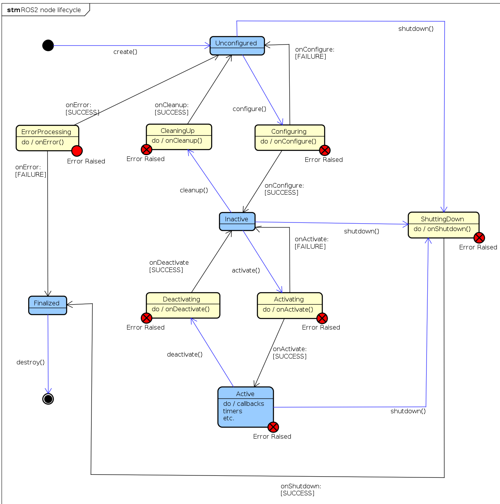

# How to Setup Tricycle Robot

## What you'll need
- First you need to have a working URDF with all the joint types properly assigned.
- The resource manager will pick up the joints which are either "revolute", "continuous", or prismatic types
- Fixed joints will not be used by ros2_control because they are not actuated

This example is aim: follow the sequence URDF → hardware plugin → controller config → launch so you can reproduce it for your own robot.

The reference file `ros2_control_demo_description/tricyclebot/urdf/tricyclebot_description.urdf.xacro`

## Robot description xacro
Start from a clean URDF/xacro description so you know exactly which joints ros2_control will expose.

```xml
<?xml version="1.0"?>
<robot xmlns:xacro="http://www.ros.org/wiki/xacro">

  <xacro:macro name="tricyclebot" params="prefix">

    <!-- Root -->
    <link name="${prefix}base_link" />

    <!-- Chassis -->
    <link name="${prefix}chassis_link">
      ...
    </link>

    <joint name="${prefix}chassis_joint" type="fixed">
      <parent link="${prefix}base_link"/>
      <child link="${prefix}chassis_link"/>
      <origin xyz="0 0 ${base_height/2 + wheel_radius + body_clearance}" rpy="0 0 0"/>
      <axis xyz="0 0 1"/>
      <dynamics damping="0.2"/>
    </joint>

    <!-- Rear right wheel -->
    <link name="${prefix}rear_right_wheel">
      ...
    </link>

    <joint name="${prefix}rear_right_wheel_joint" type="continuous">
      <parent link="${prefix}chassis_link"/>
      <child link="${prefix}rear_right_wheel"/>
      <origin
        xyz="-${wheelbase/2} ${base_width/2} -${base_height/2 + wheel_radius + wheel_clearance}"
        rpy="0 0 ${PI/2}"/>
      <axis xyz="1 0 0"/>
      <limit effort="100.0" velocity="100.0"/>
      <dynamics damping="0.2"/>
    </joint>

    <!-- Rear left wheel -->
    <link name="${prefix}rear_left_wheel">
     ...
    </link>

    <joint name="${prefix}rear_left_wheel_joint" type="continuous">
      <parent link="${prefix}chassis_link" />
      <child link="${prefix}rear_left_wheel" />
      ...
    </joint>

    <!-- Front steering link and wheel -->
    <link name="${prefix}front_steering_link">
      ...
    </link>

    <joint name="${prefix}front_steering_joint" type="revolute">
      <parent link="${prefix}chassis_link"/>
      <child link="${prefix}front_steering_link"/>
      ...
    </joint>

    <link name="${prefix}front_wheel">
     ...
    </link>

    <joint name="${prefix}front_wheel_joint" type="fixed">
      <parent link="${prefix}front_steering_link"/>
      <child link="${prefix}front_wheel"/>
      ...
    </joint>

  </xacro:macro>

</robot>

```
### Why these joint types matter
- `rear_left_wheel_joint` and `rear_right_wheel_joint` are `continuous`, so ros2_control treats them as driven wheels that can spin forever.
- `front_steering_joint` is `revolute`, so the steering actuator expects a bounded angle command.
- If a joint should move in your own robot, make sure it is `revolute`, `continuous`, or `prismatic` before you hook it to controllers.

## Writing my own plugin for hardware components

The hardware components realize communication to physical hardware and represent its abstraction in the ros2_control framework. The components have to be exported as plugins using pluginlib-library. The Resource Manager dynamically loads those plugins and manages their lifecycle.

There are three basic types of components:

**System:**
Complex (multi-DOF) robotic hardware like industrial robots. The main difference between the Actuator component is the possibility to use complex transmissions like needed for humanoid robot’s hands. This component has reading and writing capabilities. It is used when there is only one logical communication channel to the hardware (e.g., KUKA-RSI).

**Sensor:**
Robotic hardware is used for sensing its environment. A sensor component is related to a joint (e.g., encoder) or a link (e.g., force-torque sensor). This component type has only reading capabilities.

**Actuator:**
Simple (1 DOF) robotic hardware like motors, valves, and similar. An actuator implementation is related to only one joint. This component type has reading and writing capabilities. Reading is not mandatory if not possible (e.g., DC motor control with Arduino board). The actuator type can also be used with a multi-DOF robot if its hardware enables modular design, e.g., CAN-communication with each motor independently.

referece: https://github.com/ros-controls/roadmap/blob/master/design_drafts/hardware_access.md


### Lifecycle of a Hardware Component

Methods return `hardware_interface::CallbackReturn` with these meanings:

- `SUCCESS`: execution was successful
- `FAILURE`: execution failed; lifecycle transition is unsuccessful
- `ERROR`: critical error occurred; managed in `on_error` method

Hardware transitions through these states:

**UNCONFIGURED** (`on_init`, `on_cleanup`): Hardware initialized but communication not started; interfaces not imported.

**INACTIVE** (`on_configure`, `on_deactivate`): Communication established and hardware configured. States readable; command interfaces unavailable (System and Actuator only). Controllers should validate or clamp received commands.

**ACTIVE** (`on_activate`): States readable and writable. Commands sent to hardware.

**FINALIZED** (`on_shutdown`): Hardware ready for unloading; memory cleaned up.

See the lifecycle state diagram for transitions.



Use a hardware plugin to connect ros2_control to your real or simulated tricycle base. The reference implementation in `example_18/hardware/include/ros2_control_demo_example_18/tricycle_steering_system.hpp` shows all the moving parts you need to copy for your own robot.

Here is the core class definition used in the example:

```C++
#ifndef ROS2_CONTROL_DEMO_EXAMPLE_18__TRICYCLE_STEERING_SYSTEM_HPP_
#define ROS2_CONTROL_DEMO_EXAMPLE_18__TRICYCLE_STEERING_SYSTEM_HPP_

...
#include "hardware_interface/hardware_info.hpp"
#include "hardware_interface/system_interface.hpp"
...

namespace ros2_control_demo_example_18
{
class TricycleSteeringSystemHardware : public hardware_interface::SystemInterface
{
public:
  RCLCPP_SHARED_PTR_DEFINITIONS(TricycleSteeringSystemHardware)

  hardware_interface::CallbackReturn on_init(
    const hardware_interface::HardwareComponentInterfaceParams & params) override;

  hardware_interface::CallbackReturn on_configure(
    const rclcpp_lifecycle::State & previous_state) override;

  hardware_interface::CallbackReturn on_activate(
    const rclcpp_lifecycle::State & previous_state) override;

  hardware_interface::CallbackReturn on_deactivate(
    const rclcpp_lifecycle::State & previous_state) override;

  hardware_interface::return_type read(
    const rclcpp::Time & time, const rclcpp::Duration & period) override;

  hardware_interface::return_type write(
    const rclcpp::Time & time, const rclcpp::Duration & period) override;

private:
  ...
};

}  // namespace ros2_control_demo_example_18

#endif  // ROS2_CONTROL_DEMO_EXAMPLE_18__TRICYCLE_STEERING_SYSTEM_HPP_
```

`hardware_interface::(Actuator|Sensor|System)Interface` defines the base class for your hardware plugin. Override the lifecycle methods to manage initialization, configuration, activation, and deactivation of your hardware. Implement the `read` and `write` methods to handle data exchange between ros2_control and your hardware.

## Export the Plugin

To export the plugin, create the file `example_18/ros2_control_demo_example_18.xml` with the following content:

```xml
<library path="ros2_control_demo_example_18">
    <class name="ros2_control_demo_example_18/TricycleSteeringSystemHardware"
                 type="ros2_control_demo_example_18::TricycleSteeringSystemHardware"
                 base_class_type="hardware_interface::SystemInterface">
        <description>
            Tricycle steering hardware system interface for the ros2_control_demos example 18.
        </description>
    </class>
</library>
```

This XML file is required by `pluginlib` so that `controller_manager` can construct your class by name at runtime. During the build process, the macro `pluginlib_export_plugin_description_file(hardware_interface ros2_control_demo_example_18.xml)` will export it.
## Load the plugin in the robot xacro

During the build, the plugin is exported with `pluginlib_export_plugin_description_file(hardware_interface ros2_control_demo_example_18.xml)` and then loaded into `ros2_control.xacro`:

```xml
<?xml version="1.0"?>
<robot xmlns:xacro="http://www.ros.org/wiki/xacro">

    <xacro:macro name="tricyclebot_ros2_control" params="name prefix">

        <ros2_control name="${name}" type="system">
            <hardware>
                <plugin>ros2_control_demo_example_18/TricycleSteeringSystemHardware</plugin>
                <param name="example_param_hw_start_duration_sec">0</param>
                <param name="example_param_hw_stop_duration_sec">3.0</param>
            </hardware>
            <joint name="${prefix}rear_right_wheel_joint">
                <command_interface name="velocity"/>
                <state_interface name="velocity"/>
                <state_interface name="position"/>
            </joint>
            <joint name="${prefix}rear_left_wheel_joint">
                <command_interface name="velocity"/>
                <state_interface name="velocity"/>
                <state_interface name="position"/>
            </joint>
            <joint name="${prefix}front_steering_joint">
                <command_interface name="position"/>
                <state_interface name="position"/>
            </joint>
        </ros2_control>

    </xacro:macro>

</robot>
```

The `<ros2_control>` tag defines the hardware interface and joints controlled by ros2_control. The custom hardware plugin `TricycleSteeringSystemHardware` manages tricycle control, with individual joints specifying their command and state interfaces.

**Key points:**
- Match `<joint>` names exactly to your URDF or the controller will fail to start.
- Command and state interfaces support `position`, `velocity`, and `effort`—select what your actuator provides.
- Use `<gpio>` and `<sensor>` tags for additional non-actuated interfaces.

Reference: [Hardware Interface Types](https://control.ros.org/rolling/doc/ros2_control/hardware_interface/doc/hardware_interface_types_userdoc.html)

## Controller integration

The controller configuration file `example_18/bringup/config/tricyclebot_controllers.yaml` defines which controllers to load and encodes the tricycle base geometry. Adjust `wheelbase`, `traction_track_width`, and `traction_wheels_radius` to match your URDF:

```yaml
controller_manager:
    ros__parameters:
        update_rate: 10  # Hz

        joint_state_broadcaster:
            type: joint_state_broadcaster/JointStateBroadcaster

tricycle_steering_controller:
    ros__parameters:
        type: tricycle_steering_controller/TricycleSteeringController
        traction_joints_names: ['rear_right_wheel_joint', 'rear_left_wheel_joint']
        steering_joints_names: ['front_steering_joint']
        wheelbase: 0.45
        traction_track_width: 0.30
        traction_wheels_radius: 0.05
        reference_timeout: 2.0
        open_loop: false
        position_feedback: false
        velocity_rolling_window_size: 10
        base_frame_id: base_link
        odom_frame_id: odom
        enable_odom_tf: true
```

**Key parameters:**
- Joint names must match your URDF exactly or the controller will fail.
- `update_rate` controls command frequency to hardware.

## How to launch

The launch file in `example_18/bringup/launch` starts `ros2_control_node`, brings up the joint state broadcaster, and loads the tricycle steering controller with an optional TF remap flag to match your tf tree in RViz.

```python
control_node = Node(
    package="controller_manager",
    executable="ros2_control_node",
    parameters=[robot_description, robot_controllers],
    output="both",
)

joint_state_broadcaster_spawner = Node(
    package="controller_manager",
    executable="spawner",
    arguments=["joint_state_broadcaster"],
)

tricycle_controller_spawner_remapped = Node(
    package="controller_manager",
    executable="spawner",
    arguments=[
        "tricycle_steering_controller",
        "--param-file",
        robot_controllers,
        "--controller-ros-args",
        "-r /tricycle_steering_controller/tf_odometry:=/tf",
    ],
    condition=IfCondition(remap_odometry_tf),
)
```

Each component:
- `ros2_control_node` loads your URDF and controller configuration so the hardware plugin runs.
- `joint_state_broadcaster` publishes `sensor_msgs/msg/JointState` for RViz visualization.
- `tricycle_steering_controller` spawns with the same parameters file; `--controller-ros-args` remaps `/tf` if needed for your frame tree.

# Example 18: TricycleBot (steering)

*TricycleBot* is a simple mobile base with two driven rear wheels and a single steerable front wheel. This example demonstrates using the `tricycle_steering_controller` from `ros2_controllers` to command a vehicle with two traction joints and one steering joint.

URDF files: `ros2_control_demo_description/tricyclebot/urdf`

## Tutorial steps

1. Verify the robot description

```sh
ros2 launch ros2_control_demo_example_18 view_robot.launch.py
```

Note: At startup you may see the warning
"Warning: Invalid frame ID 'odom' passed to canTransform argument target_frame" — this is expected while `joint_state_publisher_gui` starts.

2. Start the example

```sh
ros2 launch ros2_control_demo_example_18 tricyclebot.launch.py
```

This loads and starts the hardware, controllers, and RViz. The hardware implementation prints its internal states to the launching terminal.

3. Inspect hardware interfaces

```sh
ros2 control list_hardware_interfaces
```

Expected output (examples):

```
command interfaces
    front_steering_joint/position [available] [claimed]
    rear_left_wheel_joint/velocity [available] [claimed]
    rear_right_wheel_joint/velocity [available] [claimed]
state interfaces
    front_steering_joint/position
    rear_left_wheel_joint/position
    rear_left_wheel_joint/velocity
    rear_right_wheel_joint/position
    rear_right_wheel_joint/velocity
```

4. Check controllers

```sh
ros2 control list_controllers
```

Expected:

```
joint_state_broadcaster[joint_state_broadcaster/JointStateBroadcaster] active
tricycle_steering_controller[tricycle_steering_controller/TricycleSteeringController] active
```

5. Send a reference command

```sh
ros2 topic pub --rate 30 /tricycle_steering_controller/reference geometry_msgs/msg/TwistStamped "
  header: auto
  twist:
     linear:
        x: 1.0
        y: 0.0
        z: 0.0
     angular:
        x: 0.0
        y: 0.0
        z: 0.5"
```

You should see the robot turning in RViz and the hardware plugin printing updated steering angle and wheel velocity.

Reference: https://github.com/ipa-vsp/ros2_control_demos (example_18 / tricycle demo)

# Example 19: TricycleBot (drive)

*TricycleBot* is a mobile base with a single front wheel that is both driven and steered plus two trailing rear wheels. This example demonstrates using the `tricycle_controller` from `ros2_controllers` to command translational and rotational velocity on a steer-drive wheel.

URDF files: `ros2_control_demo_description/tricyclebot/urdf`

## Tutorial steps

1. Verify the robot description

```sh
ros2 launch ros2_control_demo_example_19 view_robot.launch.py
```

Note: At startup you may see the warning "Warning: Invalid frame ID 'odom' passed to canTransform argument target_frame" — this is expected while `joint_state_publisher_gui` starts.

2. Start the example

```sh
ros2 launch ros2_control_demo_example_19 tricyclebot.launch.py
```

This loads and starts the hardware, controllers, and RViz. The hardware implementation prints its internal states to the launching terminal.

3. Inspect hardware interfaces

```sh
ros2 control list_hardware_interfaces
```

Expected output:

```
command interfaces
    front_steering_joint/position [available] [claimed]
    front_wheel_joint/velocity [available] [claimed]
state interfaces
    front_steering_joint/position
    front_wheel_joint/position
    front_wheel_joint/velocity
```

4. Check controllers

```sh
ros2 control list_controllers
```

Expected:

```
joint_state_broadcaster[joint_state_broadcaster/JointStateBroadcaster] active
tricycle_controller[tricycle_controller/TricycleController] active
```

5. Send a velocity command

```sh
ros2 topic pub --rate 30 /tricycle_controller/cmd_vel geometry_msgs/msg/TwistStamped "
  header: auto
  twist:
     linear:
        x: 0.5
        y: 0.0
        z: 0.0
     angular:
        x: 0.0
        y: 0.0
        z: 0.4"
```

You should see the robot turning in RViz and the hardware plugin printing updated steering angle and wheel velocity.

### Controllers from this demo

- Joint State Broadcaster: [ros2_controllers](https://github.com/ros-controls/ros2_controllers)
- Tricycle Controller: [ros2_controllers](https://github.com/ros-controls/ros2_controllers)
