# Example: Yaskawa GP50

This workshop creates a MoveIt configuration package for the Yaskawa Motoman
GP50 and uses the generated package to plan motions in RViz.

## Prerequisites

This tutorial uses ROS 2 Humble and assumes that:

- the workspace is located at `/home/ros/ros2_ws`;
- `motoman_gp50_support` is available in the workspace source directory; and
- MoveIt and the MoveIt Setup Assistant are installed.

## 1. Build the robot support package

Open a terminal and build the GP50 description and its dependencies:

```bash
source /opt/ros/humble/setup.bash
cd /home/ros/ros2_ws
colcon build --packages-up-to motoman_gp50_support
source install/setup.bash
```

## 2. Start the MoveIt Setup Assistant

```bash
ros2 run moveit_setup_assistant moveit_setup_assistant
```

Select **Create New MoveIt Configuration Package** and load this Xacro file:

```text
/home/ros/ros2_ws/src/motoman_ros2_support_packages/motoman_gp50_support/urdf/gp50.xacro
```

The robot model should appear in the preview.

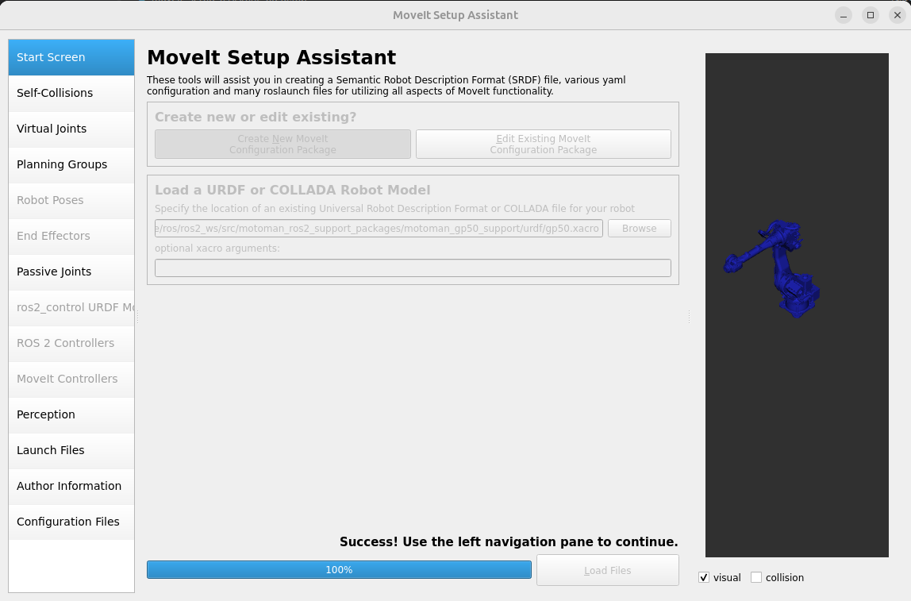

## 3. Generate the self-collision matrix

Open **Self-Collisions**, generate the collision matrix, and review the link
pairs disabled because they are adjacent or never collide.

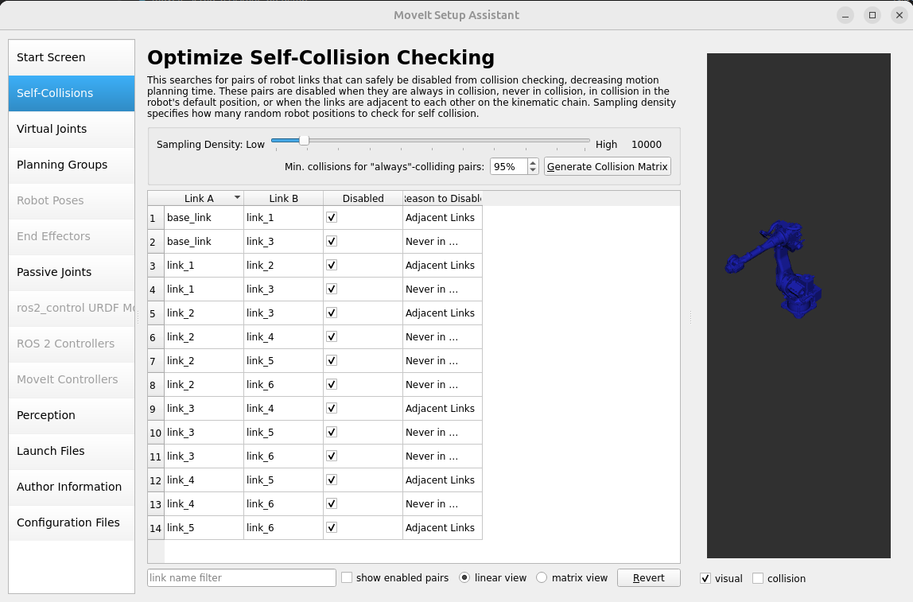

The GP50 is a fixed industrial arm. A virtual joint is unnecessary when its
base is already fixed by the robot description.

## 4. Configure the planning group

Open **Planning Groups** and select **Add Group**.

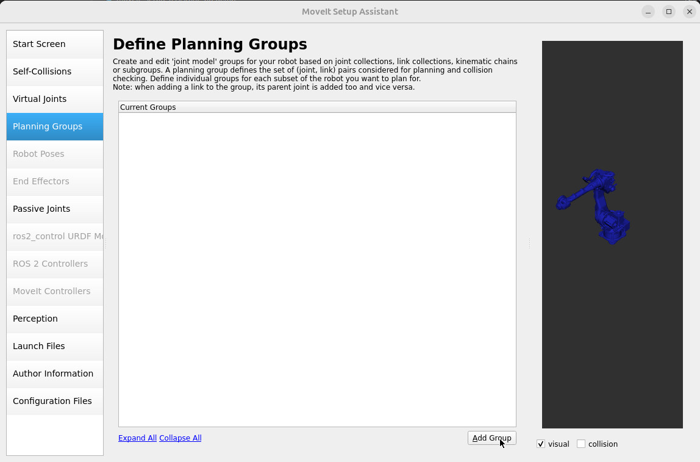

Configure the group with:

- Group name: `gp50_arm`
- Kinematic solver: `kdl_kinematics_plugin/KDLKinematicsPlugin`
- Search resolution: `0.005`
- Search timeout: `0.005`
- Default planner: `RRTConnect`

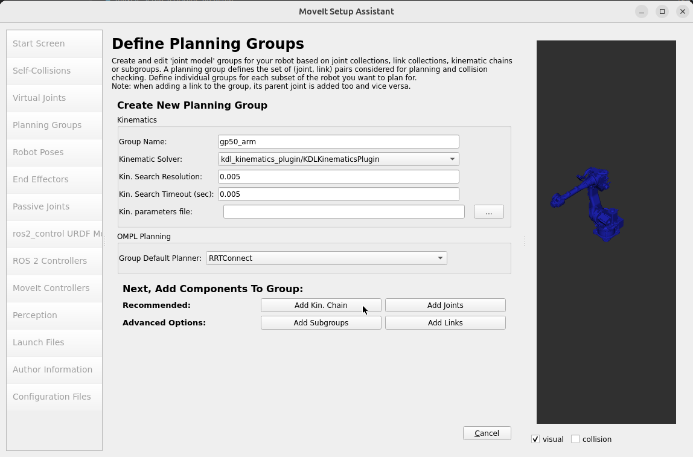

Add a kinematic chain using:

- Base link: `base_link`
- Tip link: `tool0`

Save the group after selecting both links.

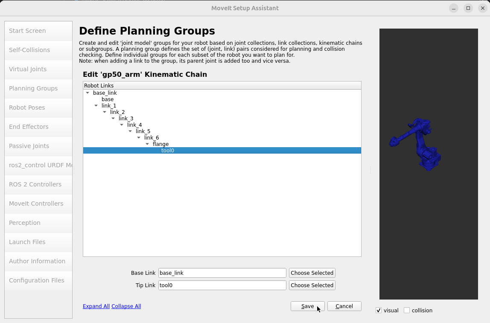

## 5. Define robot poses

Open **Robot Poses** and add useful named states for `gp50_arm`. Define `HOME`
with all six joints at zero.

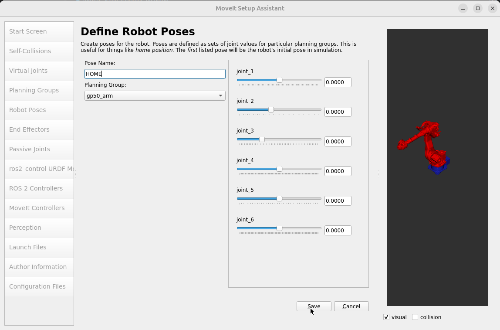

Add an `UP` pose by adjusting the joints to the required upright
configuration.

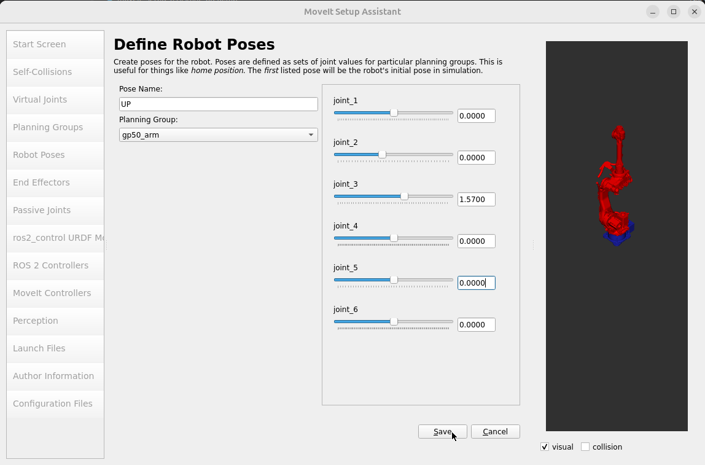

Review the saved `HOME`, `UP`, and `DOWN` poses before continuing.

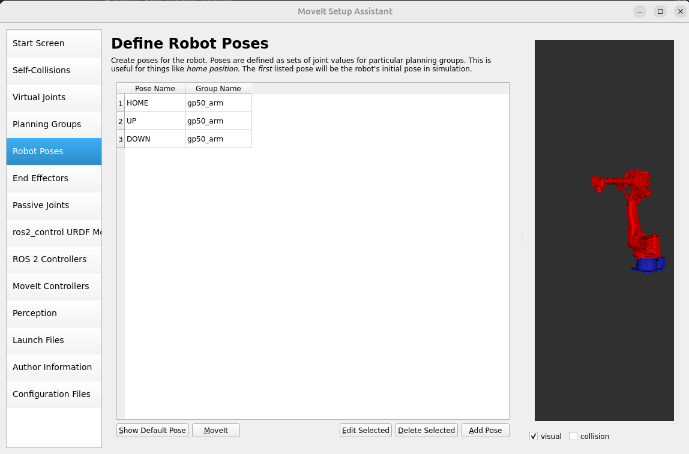

## 6. Configure ros2_control

Open **ros2_control URDF Modifications**. Add a `position` command interface
and `position` and `velocity` state interfaces for the six arm joints.

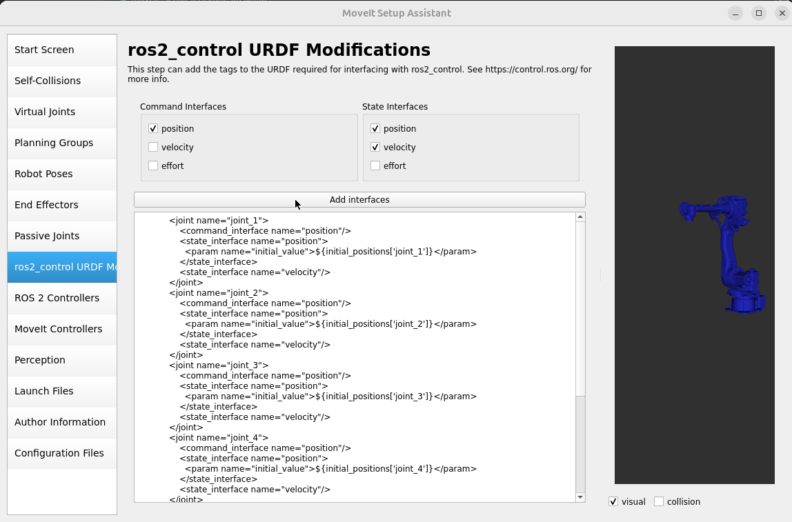

## 7. Configure the controllers

Open **ROS 2 Controllers** and use **Auto Add JointTrajectoryController
Controllers For Each Planning Group**. This creates a trajectory controller for
`gp50_arm`.

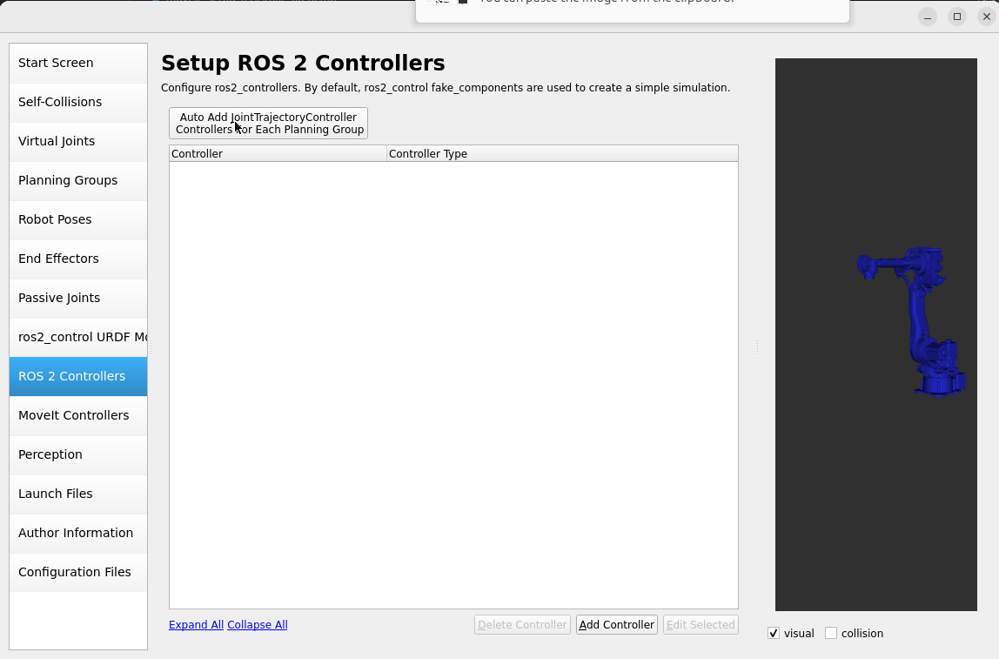

Open **MoveIt Controllers** and auto-add the corresponding
`FollowJointTrajectory` controller. Confirm that `gp50_arm_controller` contains
`joint_1` through `joint_6`.

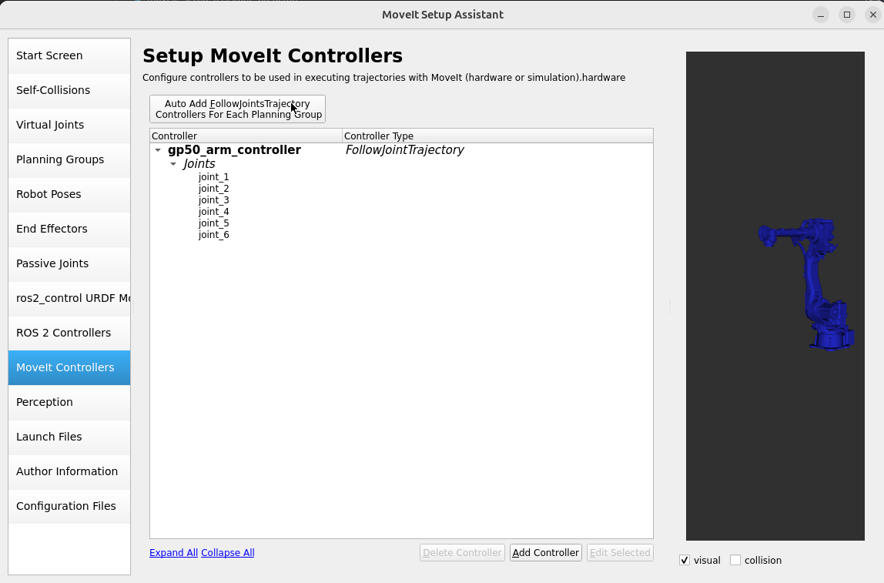

Skip **Perception** unless the robot uses a configured 3D sensor. Add your name
and email under **Author Information**.

## 8. Generate the configuration package

Open **Launch Files** and select the launch files required for the demo. The
warehouse database launch file is optional.

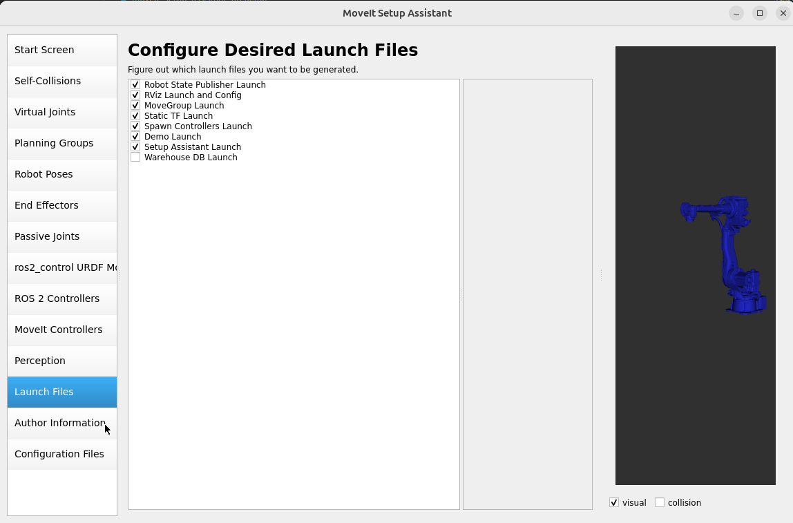

Open **Configuration Files** and use this output directory:

```text
/home/ros/ros2_ws/src/yaskawa_gp50_moveit_config
```

Review the generated files and select **Generate Package**.

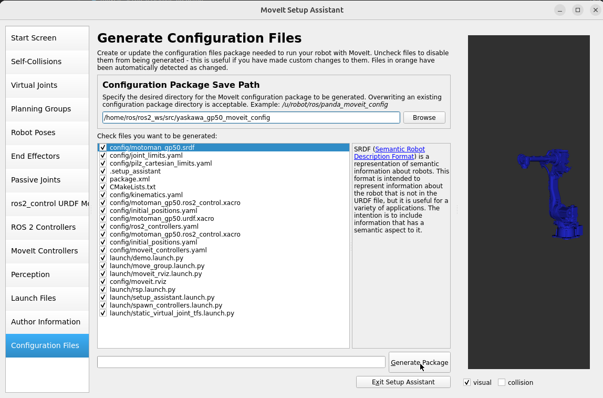

## 9. Check the joint limits

Open the generated file:

```text
/home/ros/ros2_ws/src/yaskawa_gp50_moveit_config/config/joint_limits.yaml
```

MoveIt Humble expects floating-point joint-limit values. Replace integer values
such as `2` or `0` with `2.0` or `0.0` where required.

## 10. Build and run the demo

Build the generated package and source the workspace again:

```bash
cd /home/ros/ros2_ws
colcon build --packages-up-to yaskawa_gp50_moveit_config
source install/setup.bash
```

Launch the MoveIt demo:

```bash
ros2 launch yaskawa_gp50_moveit_config demo.launch.py
```

In the RViz **MotionPlanning** panel, select `gp50_arm` as the planning group.
Choose one of the named states, then use **Plan** or **Plan & Execute** to test
the generated configuration.

## GP50 MoveIt demonstrations

### Demonstration 1

<video controls style="width: 100%; max-width: 1371px;">
  <source src="../../_static/manipulation/moveit_examples/yaskawa_gp50_moveit_2.webm" type="video/webm">
  Your browser cannot play this video.
  <a href="../../_static/manipulation/moveit_examples/yaskawa_gp50_moveit_2.webm">Download demonstration 1</a>.
</video>


### Demonstration 2

Add a box as a collider:

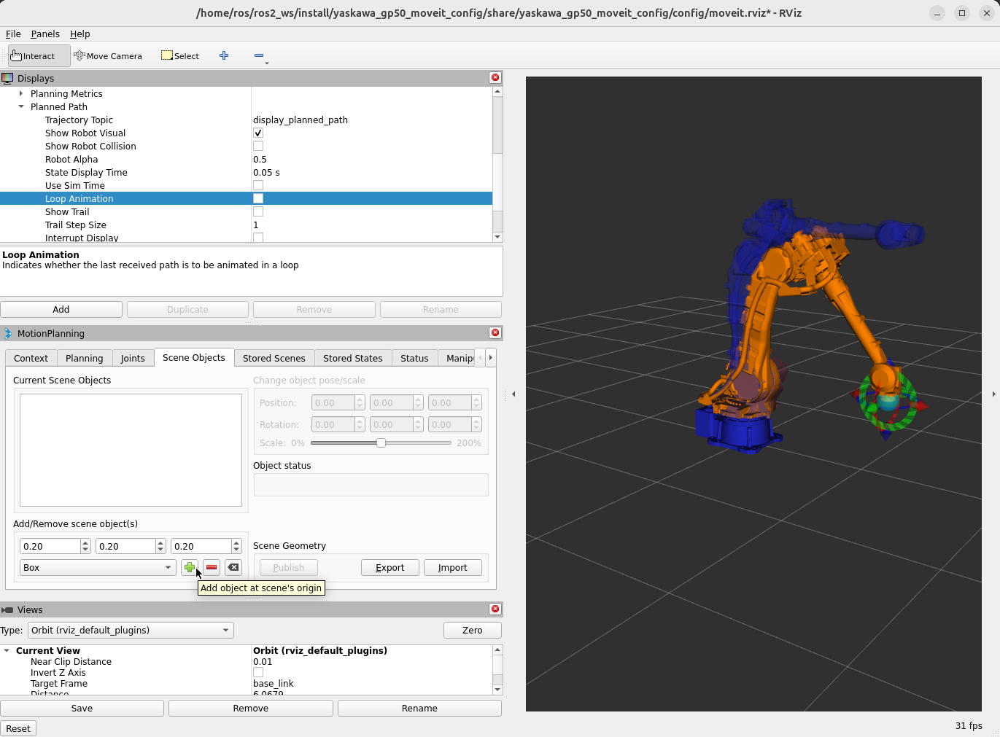

And regenerate the plan:

<video controls style="width: 100%; max-width: 1371px;">
  <source src="../../_static/manipulation/moveit_examples/yaskawa_gp50_moveit_1.webm" type="video/webm">
  Your browser cannot play this video.
  <a href="../../_static/manipulation/moveit_examples/yaskawa_gp50_moveit_1.webm">Download demonstration 2</a>.
</video>
