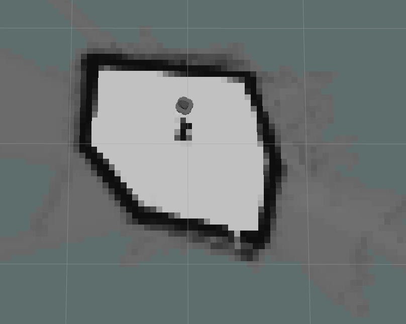
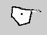

# ROS 2 Cartographer

## 1. Introduction
- The goal of this tutorial is to
    - use Cartographer to create a map of environment

- The packages that will be used:
    - cartographer 
    - cartographer-ros
    - turtlebot3_cartographer
    - turtlebot3_teleop
    - turtlebot3_gazebo

This tutorial explains how to use the Cartographer for mapping and localization. 
* Lines beginning with `$` indicates the syntax of these commands.
Commands are executed in a terminal:
    * Open a new terminal → use the shortcut ctrl+alt+t.
Open a new tab inside an existing terminal → use the shortcut ctrl+shift+t.

* Info: The computer of the real robot will be accessed from your local computer remotely. For every further command, a tag will inform which computer has to be used. It can be either `[TurtleBot]` or `[Remote PC]`.


## 2. General approach
The main problem in mobile robotics is localization and mapping. To estimate the position of the robot in an environment, you need some kind of map from this environment to determine the actual position in this environment. On the other hand, you need the actual position of robots to create a map related to its position. Therefore you can use SLAM – Simultaneous Localization and Mapping. ROS provides different
packages to solve this problem:
* **2D**: gmapping, hector_slam, cartographer, ohm_tsd_slam...
* **3D**: rgbdslam, ccny_rgbd, lsd_slam, rtabmap...

For ground-based robots, it is often sufficient to use 2D SLAM to navigate through the environment. In the following tutorial, cartographer will be used. Cartographer SLAM builds a map of the environment and simultaneously estimates the platform's 2D pose. The localization is based on a laser scan and the odometry of the robot. 


## 3. Start Cartographer
### 3.1. Technical Overview


Figure 1: Technical Overview

source: [cartographer](https://google-cartographer.readthedocs.io/en/latest/)


### 3.2. Check packages 

#### 3.2.1. Check if there are cartographer packages

    ```bash
    # source ROS 2
    $ source /opt/ros/foxy/setup.bash

    $ ros2 pkg list |grep cartographer

    # You will get 
    # cartographer_ros
    # cartographer_ros_msgs
    ```

If you don't have "cartographer_ros" and "cartographer_ros_msgs", you can install cartographer by performing the following:

**Before installing package, you need to make sure which ROS distribution you are using.**

```bash
$ sudo apt install ros-$ROS_DISTRO-cartographer 
```

#### 3.2.2. Check if there are turtlebot3* packages

```bash
$ ros2 pkg list | grep turtlebot3
```
If you don't have turtlebot3 packages, you can install debian packages or from source code. 

A. Install debian packages

```bash
sudo apt install ros-foxy-turtlebot3*
```

B. Install from source code

First entering your workspace

```bash
$ wget https://raw.githubusercontent.com/ROBOTIS-GIT/turtlebot3/foxy-devel/turtlebot3.repos
```

Make sure you have "src" folder, then run this command to get source code for turtlebot3

```bash
$ vcs import src<turtlebot3.repos
```
Source your ROS 2 installation workspace and install dependencies

```bash
$ source /opt/ros/foxy/setup.bash
$ rosdep update
$ rosdep install --from-paths src --ignore-src --rosdistro 
$ROS_DISTRO -y
```
Compile codes

```bash
$ colcon build
```
Source your workspace
```bash
$ source install/setup.bash
```


### 3.3. Startup system of turtleBot and teleoperation

#### 3.3.1. Simulation in gazebo

1. Set up turtlebot model

    ```bash
    $ export TURTLEBOT3_MODEL=burger
    ```

2. Set up Gazebo model path

    ```bash
    $ export GAZEBO_MODEL_PATH=`ros2 pkg \
    prefix turtlebot3_gazebo`/share/turtlebot3_gazebo/models/
    ```

3. Launch Gazebo with a simulation world

    ```bash
    $ ros2 launch turtlebot3_gazebo turtlebot3_world.launch.py
    ```


#### 3.3.2. Physical robot

[TurtleBot3]

a. open a terminal and use `ssh` connect to Turtlebot3.

b. bring up basic packages to start its applications.
```bash
$ source .bashrc

$ cd turtlebot3_ws

#Set up ROS_DOMAIN_ID
$ export ROS_DOMAIN_ID="Your Number"
# e.g. export ROS_DOMAIN_ID=11

$ source install/setup.bash

$ ros2 launch turtlebot3_bringup robot.launch.py
```

#### 3.3.3. Run teleoperation node

[Remote PC]

1. Open a new terminal

2. Set up ROS environment

    ```bash
    $ source /opt/ros/foxy/setup.bash
    ```
3. (Set up ROS_DOMAIN_ID)
   
   If you set up ROS_DOMAIN_ID for running turtlebot simulation or physical turtlebot, then you need to set the same ROS_DOMAIN_ID here.

    ```bash
    $ export ROS_DOMAIN_ID="Your Number"
    # e.g. export ROS_DOMAIN_ID=11
    ```

4. Set up turtlebot model

    ```bash
    $ export TURTLEBOT3_MODEL=burger
    ```
5. Run teleoperation node

    ```bash
    $ ros2 run turtlebot3_teleop teleop_keyboard
    ```


### 3.4. Run SLAM nodes

1. open a new terminal on Remote PC
   
2. Set up ROS environment
   
    ```bash
    $ source /opt/ros/foxy/setup.bash
    ```

3. (Set up ROS_DOMAIN_ID)
   
   If you set up ROS_DOMAIN_ID for running turtlebot simulation or physical turtlebot, then you need to set the same ROS_DOMAIN_ID here.

    `[Remote PC]`

    ```bash
    $ export ROS_DOMAIN_ID="Your Number"
    # e.g. export ROS_DOMAIN_ID=11
    ```

4. run the SLAM nodes

    If you are using simulation, you need to use simulation time. You can set `use_sim_time` to True.

    **a. Simulation**

    `[Remote PC]`

    ```bash
    $ ros2 launch turtlebot3_cartographer \
    cartographer.launch.py \
    use_sim_time:=True
    ```

    **b. For a real robot**

    `[Remote PC]`

    ```bash
    $ ros2 run cartographer_ros occupancy_grid_node -resolution 0.05\
    -publish_period_sec 1.0

    $ ros2 run cartographer_ros cartographer_node\
    -configuration_directory]\ 
    install/turtlebot3_cartographer/share/turtlebot3_cartographer\
    /config -configuration_basename turtlebot3_lds_2d.lua
    ```
    
 5. create a map
    
    ***Hint: Make sure that the Fixed Frame (in Global Options) in RViz is set to “map”.*** 

    In this way the map is fixed and the robot will move relative to it.
    The scanner of the Turtlebot3 covers 360 degrees of its surroundings. Thus, if objects are close by to the robot it will start to generate the map. 

    Teleoperate the robot through the physical world until the enclosed environment is completely covered in the virtual map.

    The following hints help you to create **a nice map**:

        * Try to drive as slow as possible
        * Avoid to drive linear and rotate at the same time
        * Do not drive too close to the obstacles

    In the left menu of RViz you can see several display modules. There is e.g. the RobotModel which is virtual visualization of the robot. 

    Furthermore, you can visualize the transforms of the available frames by checking the box of tf. Make yourself familiar with the available modules.
    
    
    Figure 2: A incomplete map at beginning in the real work setup

    
    Figure 3: A complete map at beginning in the real work setup


## 4. Save the Map

If you are satisfied with your map you can store it. You can save the map.

`[Remote PC]`

0. Open a new terminal and enter your workspace

1. (Set up ROS Domain ID ) 
   Only if you did set up ROS Domain ID before, you need to set up ROS Domain ID here.

2. run the map saver node.

    ```
    $ ros2 run nav2_map_server map_saver_cli 
    ```

    You also can define a name of the map by
    ```
    ros2 run nav2_map_server map_saver_cli -f my_map
    ```
    If the terminal’s path is "your workspace" they can be found in "your workspace" directory. An example of the map.pgm image is given in the following.

    


The node will create a map.pgm and a map.yaml files in the current directory, which is your workspace directory in this case.

***Hint: The signs “~/” is a direct path to the home directory which works from every relative path.***
